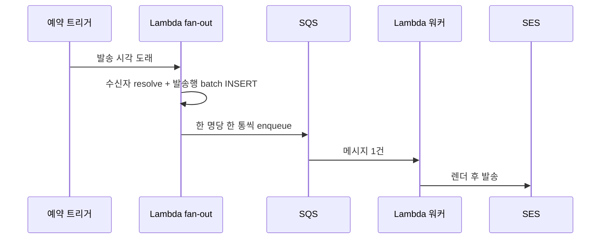
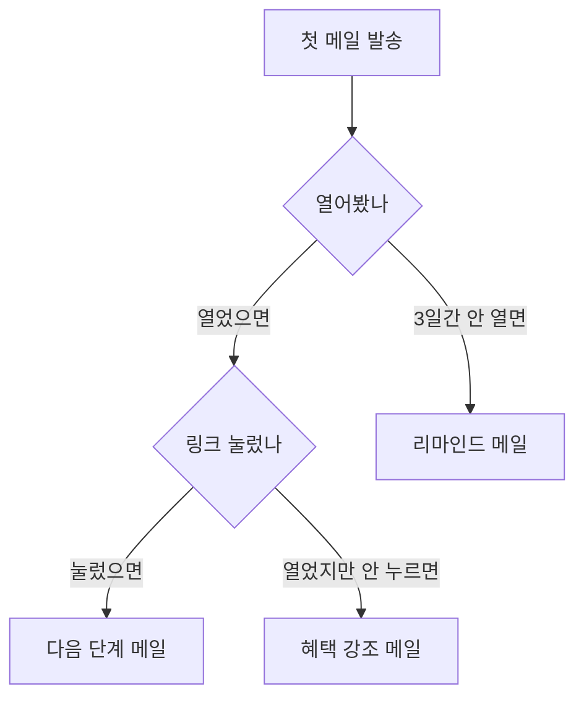

# **마케팅 메일 발송 시스템 만들기**
회사에서 마케팅 메일과 공지 메일을 발송하는 시스템을 직접 만들었다. 처음엔 그냥 외부 메일 서비스(스티비나 메일침프 같은)를 붙이면 되는거 아닌가 싶었는데, 막상 요구사항을 들어보니 사내 다른 서비스들과 구독자 정보를 주고받아야 하고, 발송 결과를 우리 쪽에 쌓아서 통계도 봐야 하고, 외부 SaaS에 고객 이메일을 통째로 넘기는것도 좀 그래서 결국 직접 만드는 쪽으로 갔다.

이 글은 그걸 AWS 위에 어떻게 얹었는지에 대한 기록이다. 시스템 이름은 그대로 쓸수 없으니 여기선 그냥 Mailroom 이라고 부르겠다.

## **뭘 하는 시스템인가**
한줄로 요약하면 "구독자를 모아두고, 템플릿으로 메일을 만들어서, 예약/자동으로 발송하고, 발송 후 반응을 추적하는" 시스템이다.

- 구독자 관리 (등록, 일괄 등록, 비활성)
- 템플릿으로 메일 본문 작성
- 예약 발송과 자동 발송
- 열람 / 클릭 / 반송 / 수신거부 추적
- 반송나거나 스팸신고당한 주소를 알아서 제외

특징이 하나 있는데, 이 시스템은 사내 전용이라 외부에 열린 입구가 거의 없다. 사내 다른 서비스가 구독자를 등록하는 API, 메일 받은 사람이 누르는 수신거부 페이지 정도가 전부고, 나머지 운영은 전부 사내 어드민에서만 한다. 입구가 적다는 점이 뒤에 나올 구성에 영향을 준다.

## **서버 구성도**
AWS 리소스 기준으로 그리면 이렇다.

```mermaid
architecture-beta
    service sqs(aws:amazon-simple-queue-service)[SQS]
    service eb(aws:amazon-eventbridge)[EventBridge]
    junction jin
    service client(internet)[Client]
    service cf(aws:amazon-cloudfront)[CloudFront]
    service lambda(aws:aws-lambda)[Lambda]
    service ses(aws:amazon-simple-email-service)[SES]
    service s3(aws:amazon-simple-storage-service)[S3 SPA]
    service db(aws:amazon-rds)[RDS]
    service sns(aws:amazon-simple-notification-service)[SNS]

    sqs:B --> T:jin
    eb:R --> L:jin
    jin:B --> T:lambda
    client:R --> L:cf
    cf:R --> L:lambda
    cf:B --> T:s3
    lambda:B --> T:db
    lambda:R --> L:ses
    ses:B --> T:sns
```

핵심은 두가지다. 외부에서 들어오는 트래픽은 CloudFront 한곳으로 모이고, Lambda는 딱 하나인데 들어오는 이벤트 종류에 따라 알아서 다른 일을 한다. 하나씩 풀어보겠다.

## **CloudFront 하나로 묶고 경로로 가른다**
프론트(React)와 백엔드(API)를 따로 도메인을 두지 않고, CloudFront 단일 도메인 아래에 경로로 갈랐다. 정적 페이지 요청은 S3로, `/api` 로 시작하는 요청은 Lambda로 보낸다.

이렇게 한 이유는 두가지다. 첫째, 프론트랑 API가 같은 출처(origin)가 되니까 CORS를 신경쓸 일이 거의 없다. 둘째, 어드민 인증을 CloudFront 앞단에서 처리할수 있다. API Gateway를 따로 두는 방법도 있었지만, 트래픽이 큰 시스템도 아닌데 CloudFront + Lambda Function URL 조합이면 충분했다.

## **Lambda 는 하나, 이벤트로 갈라진다**
이 시스템에서 제일 마음에 드는 구조다. Lambda 함수가 사실상 하나다. HTTP 요청도, SQS 메시지도, SNS 이벤트도, 예약 트리거도 전부 같은 zip, 같은 핸들러가 받는다. 그리고 들어온 이벤트의 생김새를 보고 어디로 보낼지 스스로 정한다.

~~~python
def lambda_handler(event, context):
    if _is_sqs_event(event):
        return worker_send.handle(event)        # 발송 큐 워커
    if _is_sns_event(event):
        return event_handler.handle(event)      # SES 이벤트 수집
    if _is_scheduler_event(event):
        return scheduler_send.handle(event)     # 예약 발송 트리거
    if _is_http_event(event):
        return route_http(event)                # 어드민 / 외부 API
    return {"statusCode": 200, "body": "unknown event source"}
~~~

판별은 어렵지 않다. SQS면 레코드의 `eventSource` 가 `aws:sqs`, SNS면 `EventSource` 가 `aws:sns`, HTTP면 `requestContext.http` 가 있다. 예약 트리거는 우리가 만들때 payload에 표식을 박아두고 그걸로 구분한다.

함수를 기능별로 쪼개는 방법도 있지만, 그러면 배포할때 여러개를 신경써야 하고 공통 코드를 동기화해줘야 한다. 단일 zip이면 하나만 올리면 끝이다. 콜드스타트가 좀 늘어나는 단점은 있는데 사내 트래픽 규모에선 체감이 안된다. 트래픽이 커지거나 함수별로 메모리/타임아웃을 따로 잡아야 하는 상황이 오면 그때 쪼개면 된다.

## **발송은 왜 SQS 를 거치나**
메일 발송을 Lambda에서 바로 SES로 쏘지 않고 SQS를 한단계 끼웠다. 이유는 한 번의 예약 발송이 실제로는 수만 통의 발송으로 쪼개지기 때문이다.

예약 발송 한건을 등록하면, 발송 시각에 EventBridge Scheduler가 Lambda를 깨운다. 그 Lambda(이하 fan-out 단계)가 하는 일은 "이 발송의 수신자가 누구누구인지 추려서, 한 명당 한 통씩 만들어 큐에 넣는것" 까지다. 실제 SES 호출은 큐 뒤의 워커가 한다.

이렇게 발송과 fan-out을 분리한 이유는 단순하다. 수신자가 수만명인데 한 Lambda 실행 안에서 전부 SES로 쏘려고 하면 타임아웃에 걸리고, 중간에 하나 실패하면 어디까지 보냈는지 복구하기도 까다롭다. 큐를 끼우면 한 통이 곧 메시지 한 개라, 실패한 그 한 통만 재시도하거나 DLQ로 격리할수 있다.

## **수만 통을 어떻게 쏟아내나**
fan-out 단계가 사실상 이 시스템에서 제일 무거운 일이다. 큰 발송은 한 번에 1.5만 ~ 5만 통까지 나간다. 여기서 신경쓴게 몇 가지 있다.

먼저 DB INSERT와 SQS 투입을 둘 다 batch로 묶었다. 수신자별 발송 행을 하나씩 INSERT하면 수만 번 왕복이라, 한 번에 묶어서 넣는다. 큐도 마찬가지로 SQS의 `send_message_batch` 를 쓰는데, 이건 요청 한 번에 최대 10건까지만 받는다. 그래서 10개씩 끊어서 던진다.

~~~python
def enqueue_send_batch(send_log_ids):
    succeeded, failed = [], []
    # SQS send_message_batch 한도 = 10건
    for i in range(0, len(send_log_ids), 10):
        chunk = send_log_ids[i:i + 10]
        resp = sqs.send_message_batch(
            QueueUrl=SEND_QUEUE_URL,
            Entries=[
                {"Id": str(idx), "MessageBody": json.dumps({"send_log_id": sid})}
                for idx, sid in enumerate(chunk)
            ],
        )
        for ok in resp.get("Successful", []):
            succeeded.append(chunk[int(ok["Id"])])
        for fl in resp.get("Failed", []):
            failed.append(chunk[int(fl["Id"])])
    return succeeded, failed
~~~

대충 계산해보면, 1.5만 통이면 1500번 호출이고 한 번에 100ms 잡아도 150초쯤이다. Lambda 타임아웃을 5분으로 잡아두면 안에 들어온다. 메모리도 5만 건 정도의 발송 행을 메모리에 들고 있어봐야 50MB 안팎이라, 1024MB 안에서 여유가 있다. 이런 숫자를 미리 한번 따져봐야 "이 함수가 어느 규모까지 버티나" 가 가늠이 된다.

## **같은 발송이 두 번 나가면 안된다**
이게 fan-out에서 제일 무서운 부분이다. 무슨 이유로든 같은 예약 트리거가 두 번 들어오면, 5만 통이 두 번 나갈수 있다. EventBridge Scheduler는 한 번 쏘고 일정을 지우게 해놨지만, 그것만 믿을순 없다.

그래서 fan-out 맨 앞에서 원자적으로 "claim" 을 한다. 발송 상태를 `SCHEDULED` 에서 `RUNNING` 으로 바꾸는 UPDATE를 조건부로 날려서, 그게 성공한 호출만 실제 발송을 진행한다. 동시에 두 번 들어와도 UPDATE에 성공하는건 하나뿐이라, 나머지는 조용히 빠진다.

~~~python
if scheduled_send.status != "SCHEDULED":
    return  # 이미 누가 처리했음

# UPDATE ... SET status='RUNNING' WHERE id=? AND status='SCHEDULED'
# 영향받은 row 가 1이면 내가 claim 성공, 0이면 남이 먼저 가져감
if not claim_scheduled_send_for_run(scheduled_send_id):
    return  # 다른 실행이 이미 가져감
~~~

워커 쪽에도 같은 장치가 있다. 큐에서 꺼낸 발송 행이 이미 `PENDING` 이 아니면 그냥 건너뛴다(성공 취급). SQS는 같은 메시지를 드물게 두 번 줄수 있고 DLQ 재처리도 있으니, 워커가 멱등하지 않으면 중복 발송이 난다.

## **실패를 어디로도 흘리지 않기**
대량 발송에서 제일 신경쓴 두번째가 "실패한 한 통을 잃어버리지 않는것" 이다. 여기엔 함정이 하나 있었다.

SES 발송이 실패했을때, 그게 일시적 실패(throttling 등)인지 영구적 실패(주소가 아예 invalid)인지를 갈라야 한다. 일시적 실패는 잠시 후 재시도하면 되니까 발송 행을 `PENDING` 그대로 두고 예외를 던진다. 그러면 SQS가 그 메시지를 다시 큐에 넣어 워커가 재처리한다. 반면 영구적 실패는 `FAILED` 로 박고 끝낸다.

~~~python
try:
    send_email(...)
except SesSendError as e:
    if e.code in RETRYABLE_CODES:        # Throttling, ServiceUnavailable ...
        raise RetryableSendError(e)      # PENDING 유지 → SQS 재시도
    mark_failed(req_id, reason=str(e))   # 영구 실패만 FAILED
~~~

처음엔 실패면 무조건 `FAILED` 로 박았는데, 이게 문제였다. throttling으로 한번 실패한 메시지를 SQS가 재시도해줘도, 워커가 "어 이거 PENDING 아니네(FAILED네)" 하고 건너뛴다. 결국 그 메일은 영영 안 나가고, DLQ로도 안 간다. 조용히 증발하는 것이다. 그래서 재시도 가능한 실패는 절대 FAILED로 박으면 안된다. 이거 깨닫는데 한참 걸렸다.

partial failure도 챙겨야 한다. `send_message_batch` 는 10건 중 일부만 실패해서 돌아올수 있다. 실패한것만 모아서 한 번 더 재시도하고, 그래도 안되면 그 행은 FAILED로 마킹한다.

마지막 안전망이 하나 더 있다. fan-out 도중에 Lambda가 죽거나 enqueue가 일부 누락되면, 발송 행이 `PENDING` 인 채로 큐에 안 들어간 상태로 떠버린다. 그래서 매 분 도는 cron이 "5분 넘게 PENDING인데 큐에 없는것 같은" 행들을 주워서 다시 enqueue한다. 멱등성을 만들어둔 덕에, 혹시 중복으로 들어가도 워커가 알아서 건너뛴다.

## **왜 RDS 인가**
DB는 PostgreSQL(RDS)을 썼다. 서버리스 구성이니 DynamoDB도 후보였는데 안 골랐다. 이유는 단순하다. 이 시스템 데이터는 구독자, 발송 이력, 이벤트가 서로 엮여있고, "이 캠페인의 이번달 열람률" 같은 집계 쿼리를 자주 돌려야 한다. 이런건 관계형 + SQL이 압도적으로 편하다. DynamoDB로 짜면 이런 조회 패턴마다 인덱스를 미리 설계해야 하는데 그게 더 골치아팠다.

인스턴스는 크게 잡지 않았다. 사내 규모에선 부하가 미미해서 작은 등급 하나로 충분하다. 나중에 부하가 늘면 그때 키우면 된다.

## **발송하고 끝이 아니다 - 반송 처리**
사실 발송 자체는 일의 절반도 안된다. 진짜 일은 보낸 다음에 있다. 없는 주소로 보내거나(hard bounce), 받는 사람이 스팸 신고를 눌러버리는(complaint) 경우가 생각보다 많은데, SES는 이걸 그냥 넘어가지 않는다. 계정마다 반송률과 불만율을 보고 있고, 이게 일정 수준을 넘으면 발송이 정지될수 있다.

> 반송률이 5%를 넘으면 검토 대상, 10%를 넘으면 발송이 일시 중지될 수 있습니다. 불만율은 0.1%만 넘어도 위험합니다.

그래서 한번 튕긴 주소는 다음부터 발송 대상에서 빼줘야 한다. SES가 이걸 어떻게 알려주냐면, Configuration Set 이라는 설정을 통해 발송 이벤트(반송/신고/열람 등)를 SNS로 흘려보낸다. 위 구성도의 `SES -> SNS` 화살표가 이거다. 그리고 그 SNS는 다시 Lambda를 깨운다. SQS나 EventBridge와 똑같이 Lambda를 트리거하는 이벤트 소스인 셈이라, 발송하고 한참 뒤에 도착하는 반송 이벤트도 같은 단일 핸들러가 받아서 처리한다.

처리 규칙은 간단하다. 반송 타입이 영구적(Permanent)이면 죽은 주소니까 즉시 제외하고, 스팸 신고는 더 위험한 신호라 무조건 제외한다. 일시적(Transient) 반송은 한번은 봐주되 연속으로 쌓이면 제외한다.

~~~python
def handle_event(detail, event_type):
    if event_type == "Bounce":
        if detail["bounceType"] == "Permanent":
            for r in detail["bouncedRecipients"]:
                deactivate(r["emailAddress"], reason="hard bounce")
    elif event_type == "Complaint":
        for r in detail["complainedRecipients"]:
            deactivate(r["emailAddress"], reason="스팸 신고")
~~~

이렇게 제외된 주소는 다음 발송 대상을 뽑는 쿼리에서 자연스럽게 빠진다. 여기서 한참 헤맸던게 하나 있는데, 처음에 SNS 토픽만 만들어두고 왜 이벤트가 안오나 한참을 봤다. 알고보니 Configuration Set과 SNS를 연결하고 발송 메일에 그 Set 이름을 박아주는 단계를 빠뜨렸던 거였다. SES는 알아서 던져주지 않는다. 명시적으로 연결해줘야 한다.

## **이 시스템의 꽃 - 행동 기반 시나리오**
지금까지가 "메일을 어떻게 잘 보내고 결과를 어떻게 받느냐" 였다면, 이 시스템에서 제일 공들인 기능은 따로 있다. 받는 사람의 행동에 따라 다음 메일이 갈라지는 시나리오다.

예를 들면 이런거다. 첫 메일을 보낸다. 열어봤으면 다음 단계로 넘어가고, 3일이 지나도 안 열어봤으면 리마인드 메일을 한 번 더 보낸다. 열어보긴 했는데 본문 링크는 안 눌렀으면 혜택을 강조하는 메일을 보낸다. 이걸 사람이 일일이 챙기는게 아니라 시스템이 알아서 한다.

이걸 어떻게 구현했냐면, 시나리오를 노드와 엣지로 이뤄진 그래프로 모델링했다. 위 그림이 그대로 데이터다. 동그라미/네모가 노드(메일 발송, 분기, 종료)고, 화살표가 엣지(조건)다. 구독자 한 명이 시나리오에 합류하면 그 사람을 가리키는 행이 하나 생기고, 그 행이 그래프 위를 한 노드씩 이동한다. 일종의 상태기계다.

핵심은 "언제, 어디로 갈지" 를 판단하는 규칙인데, 이 규칙(지연 시간과 조건)을 전부 엣지가 들고 있다. 조건 종류는 이런 것들이다.

- 열었음 / 안 열었음
- 열었지만 링크 클릭은 안 함
- 특정 링크를 클릭함
- 반송됨

여기서 좀 신경썼던게 "언제 판단하냐" 다. 조건마다 시간 기준이 다르다. "안 열었음" 같은 조건은 메일을 보낸 시각을 기준으로 잰다. 보내고 3일이 지나도록 열람 이벤트가 없으면 미개봉으로 판정하는 식이다. 반대로 "클릭함" 같은 행동 조건은 그 행동이 일어난 시각을 기준으로 잰다. 4일째 되는 날 클릭했으면, 그 클릭한 날로부터 다시 N일을 센다. 이 둘을 같은 기준으로 처리하면 "안 누른 사람한테 가는 메일" 과 "누른 사람한테 가는 메일" 의 타이밍이 꼬여버린다.

## **클릭은 1분을 기다리지 않는다**
시나리오 진행은 매분 도는 cron이 맡는다. "지금 판단할 때가 된 사람" 들을 모아서 다음 노드로 보내는 식이다. 그런데 여기에 한 가지 문제가 있다. "안 열었음" 같은 조건은 어차피 며칠을 기다리는 거라 매분 체크해도 상관없는데, "클릭함" 은 다르다. 사용자가 방금 링크를 눌렀는데 "다음 분기 평가는 다음 cron 때" 라고 기다리게 하면 어색하다.

그래서 클릭/열람 이벤트가 들어오면(앞에서 본 SES → SNS → Lambda 경로), 그 이벤트를 받은 Lambda가 해당 구독자의 "다음 판단 시각" 을 현재로 앞당겨놓는다. 그러면 바로 다음 cron이 돌 때 그 사람이 후보로 잡혀서 즉시 다음 단계로 넘어간다. 행동이 일어난 순간에 반응하는 것처럼 동작하면서도, 실제 처리는 cron 한 곳에 모아두는 구조다.

## **cron 이 매분 도는데 비용은 괜찮나**
여기까지 보면 의문이 하나 생긴다. 캠페인용 cron, 시나리오용 cron이 각각 1분마다 계속 돈다. 하루 1440번, 한 달이면 4만 번이 넘는다. 이거 비용 폭탄 아닌가?

결론부터 말하면 거의 공짜다. 핵심은 Lambda가 "떠 있는 시간" 이 아니라 "실제 일한 시간(GB-초)" 으로 과금된다는 점이다. 할 일이 없는 cron 실행은 DB에 "지금 처리할 사람 있어?" 쿼리 한 방 날리고 없으면 그냥 끝난다. 0.1~0.2초 안에 종료된다.

대충 계산해보면 이렇다. 매분 실행이면 한 달에 약 43,000번이다. 한 번에 1024MB로 0.2초 잡으면, 43,000 × (1GB × 0.2초) = 약 8,600 GB-초다. Lambda 프리티어가 매달 400,000 GB-초를 주니까, 이건 그 2% 수준이다. 프리티어를 다 썼다고 쳐도 GB-초 단가로 환산하면 한 달에 20센트가 안된다. EventBridge 트리거 비용까지 더해도 몇십 센트 선이다.

만약 이걸 상시 떠 있는 서버(ECS나 EC2)에 올려서 폴링했다면 얘기가 다르다. 그쪽은 일이 있든 없든 시간당 과금이라, 한가한 새벽에도 계속 돈이 나간다. cron + Lambda 조합은 "할 일 없을 때 비용이 0에 수렴" 한다는게 제일 큰 장점이다. 폴링 주기가 1분이라 무겁게 들리지만, 빈 폴이 워낙 가벼워서 실제 청구서엔 거의 안 잡힌다.

## **정리**
- 외부 입구는 CloudFront 한곳, 경로로 프론트(S3)와 API(Lambda)를 가른다.
- Lambda는 단일 함수가 이벤트 종류로 갈라져 일한다.
- 발송은 fan-out으로 한 통씩 쪼개 SQS에 batch로 넣고, 워커가 큐에서 꺼내 SES로 보낸다.
- 같은 발송이 두 번 나가지 않게 claim으로 막고, 실패는 재시도/DLQ/cron 안전망으로 흘리지 않는다.
- 발송 결과(반송/신고 등)는 SES에서 SNS를 거쳐 다시 Lambda로 돌아와 처리된다.
- 행동 기반 시나리오는 노드/엣지 그래프 상태기계로 모델링하고, 매분 cron이 진행시킨다. 클릭/열람은 이벤트로 즉시 앞당긴다.
- 매분 도는 cron은 빈 폴이 워낙 가벼워서, 상시 서버 폴링과 달리 비용이 거의 안 든다.

발송 코드 짜는 시간보다 이 주변(큐, 멱등성, 실패 복구, 반송 처리)을 설계하는데 시간을 더 썼는데, 돌이켜보면 그게 맞았다. 발송만 되는건 누구나 만들지만, 수만 통을 한 통도 안 흘리고 두 번도 안 보내게 만드는건 다른 얘기였다.
