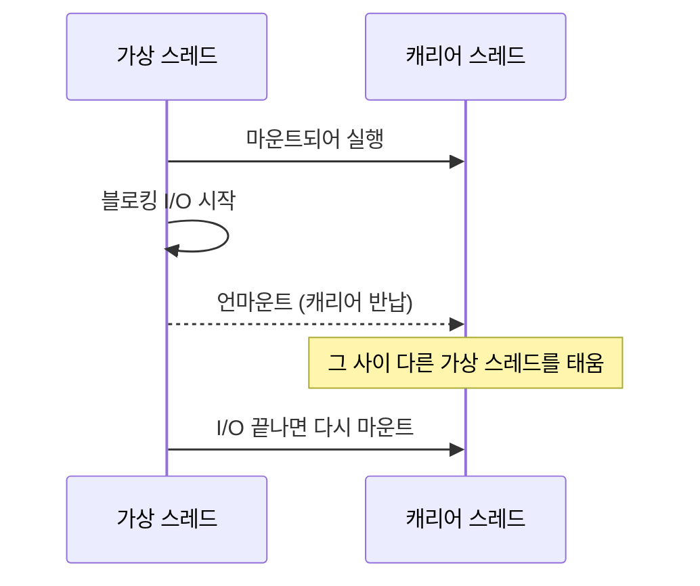

# **Java 가상 스레드 적용기**
회사 서비스 중에 외부 API를 잔뜩 호출하는 녀석이 하나 있다. 요청 하나를 처리하려면 외부 시스템 서너곳에 다녀와야 하는데, 각 호출이 다 끝날때까지 스레드가 그냥 멍하니 기다린다. 트래픽이 몰리면 톰캣 스레드풀(기본 200개)이 금방 동나고, 그 다음 요청들은 큐에서 줄을 선다. CPU는 놀고 있는데 처리량은 안 올라가는 전형적인 상황이다.

스레드를 더 늘리면 되지 않냐 하겠지만, 플랫폼 스레드(OS 스레드)는 하나당 메모리를 꽤 먹어서 무작정 늘릴수가 없다. 보통 수천개 수준이 한계다. 그래서 Java 21에 정식으로 들어온 가상 스레드(Virtual Thread)를 한번 보기로 했다.

## **가상 스레드가 뭐냐**
간단히 말하면 "엄청 가벼운 스레드" 다. OS 스레드를 직접 점유하는게 아니라, JVM이 관리하는 가벼운 스레드를 수십만개씩 만들수 있다. 핵심은 블로킹 동작에서의 처리 방식이다.

가상 스레드는 실행될때 캐리어 스레드(carrier thread, 실제 OS 스레드)에 올라타서(마운트) 돈다. 그러다 I/O 같은 블로킹을 만나면, 캐리어에서 내려와(언마운트) 캐리어를 반납한다. 그 사이 캐리어는 다른 가상 스레드를 태운다. I/O가 끝나면 다시 아무 캐리어에나 올라타 이어서 실행된다.

그러니까 "기다리는 동안 OS 스레드를 붙잡지 않는다" 가 전부다. 외부 호출을 기다리느라 멍때리는 스레드가 OS 자원을 안 잡고 있으니, 그 시간에 다른 일을 할수 있다. I/O 대기가 많은 작업일수록 효과가 크다.

## **진짜 그런지 실험**
말로만 들으면 와닿지가 않아서 직접 돌려봤다. 2초 걸리는 외부 호출을 흉내낸 작업(`Thread.sleep(2000)`)을 1만번 동시에 실행한다.

~~~java
void run(ExecutorService executor) throws InterruptedException {
    var start = System.currentTimeMillis();
    var latch = new CountDownLatch(10_000);

    for (int i = 0; i < 10_000; i++) {
        executor.submit(() -> {
            try {
                Thread.sleep(2000);   // 외부 호출이라 치자
            } catch (InterruptedException e) {
                Thread.currentThread().interrupt();
            } finally {
                latch.countDown();
            }
        });
    }

    latch.await();
    System.out.println("걸린 시간: " + (System.currentTimeMillis() - start) + "ms");
}
~~~

플랫폼 스레드 200개짜리 풀로 돌리면, 1만개 작업을 200개씩 나눠서 처리하니 50번에 걸쳐 처리된다. 50 × 2초 = 약 100초.

~~~java
// 플랫폼 스레드 200개
run(Executors.newFixedThreadPool(200));
// → 걸린 시간: 약 100,000ms

// 가상 스레드 (작업마다 새 가상 스레드)
run(Executors.newVirtualThreadPerTaskExecutor());
// → 걸린 시간: 약 2,000ms
~~~

100초 대 2초다. 1만개가 거의 동시에 떠서 다같이 2초 기다리고 끝난다. sleep을 진짜 외부 API 호출로 바꿔도 양상은 비슷하다. 이쯤 되니 솔깃했다.

스프링 부트(3.2 이상)라면 적용도 간단하다. 설정 한 줄이면 톰캣이 요청마다 가상 스레드를 쓴다.

~~~yaml
spring:
  threads:
    virtual:
      enabled: true
~~~

근데 이게 "한 줄 켜면 다 빨라짐" 이었으면 글을 안 썼을거다. 켜고 나서 두 군데서 발목을 잡혔다.

## **함정 1 - synchronized 안에서 멈추면 (pinning)**
가상 스레드의 마법은 "블로킹되면 캐리어를 반납한다" 였다. 그런데 이게 안 되는 경우가 있다. 가상 스레드가 캐리어에서 못 내려오고 못박히는 상황을 pinning 이라고 부르는데, JDK 21 기준 주로 두 가지에서 생긴다. 하나는 `synchronized` 블록이나 메서드 안에서 블로킹할 때, 다른 하나는 native 메서드(JNI나 Foreign Function API)를 호출하는 도중에 블로킹할 때다. 후자는 우리가 직접 짤 일은 드물고 보통 라이브러리 내부에서 일어나는데, 전자는 우리 코드에 흔하다.

pinning이 일어나면 그 가상 스레드는 OS 스레드 하나를 점유한 채로 기다린다. 가상 스레드를 쓰는 의미가 사라지는 것이다. 문제는 이게 조용히 일어난다는 점이다. 코드는 잘 도는데 처리량만 안 나온다.

예를 들어 이런 코드가 있으면,

~~~java
private final Object lock = new Object();

public void call() {
    synchronized (lock) {
        externalApi.fetch();   // 이 블로킹 동안 캐리어가 묶인다
    }
}
~~~

`externalApi.fetch()` 가 2초 걸리는 동안 캐리어 스레드가 묶여버린다. 가상 스레드를 1만개 만들어도, synchronized 때문에 동시에 도는건 캐리어 개수만큼으로 쪼그라든다. 아까 실험에서 본 100초의 세계로 돌아가는 것이다.

여기서 캐리어가 몇 개냐가 궁금해지는데, 가상 스레드를 굴리는 스케줄러는 기본적으로 `ForkJoinPool` 이고 그 병렬도(parallelism)가 `Runtime.availableProcessors()` 로 잡힌다. 8코어 머신이면 캐리어가 8개라는 얘기다. 그러니 pinning이 걸리면 1만개를 만들었어도 실제로는 8개씩만 돌아간다. 이 값은 `-Djdk.virtualThreadScheduler.parallelism` 으로 늘릴수도 있는데, pinning을 이걸 키워서 덮는건 미봉책이다. 캐리어를 늘리면 그만큼 OS 스레드를 더 잡는거라, 결국 가상 스레드를 안 쓰던 시절로 반쯤 돌아가는 셈이다. 근본은 pinning을 없애는 거다.

이게 의심되면 JVM 옵션으로 추적할수 있다.

~~~
-Djdk.tracePinnedThreads=full
~~~

이걸 켜면 pinning이 발생할때 스택 트레이스를 찍어준다. 나는 이걸로 우리 코드에서 synchronized 걸린 구간 몇 개를 찾았다. 해결은 대부분 `synchronized` 를 `ReentrantLock` 으로 바꾸면 된다. ReentrantLock은 가상 스레드가 정상적으로 언마운트된다.

~~~java
private final ReentrantLock lock = new ReentrantLock();

public void call() {
    lock.lock();
    try {
        externalApi.fetch();   // 이제 캐리어를 반납한다
    } finally {
        lock.unlock();
    }
}
~~~

참고로 이 synchronized pinning 문제는 JDK 24에서 JEP 491로 해결됐다. synchronized 안에서 블로킹돼도 더이상 캐리어를 안 묶는다. 다만 모든 pinning이 사라지는건 아니다. native 메서드 호출이나 클래스 초기화 도중의 블로킹은 24 이후에도 여전히 pinning이다(이건 흔하진 않다). 그리고 우리는 운영에서 LTS 버전을 쓰고 있고, 현재 LTS인 21에는 이 개선 자체가 없다. 그래서 당분간은 ReentrantLock으로 우회하는 수밖에 없다. 곧 다음 LTS인 25가 나온다니, 거기로 올리면 synchronized 쪽 고민은 자연히 사라질것 같다.

추적 옵션도 버전마다 다르다. 위에서 쓴 `-Djdk.tracePinnedThreads` 는 21에선 잘 동작하는데, JDK 24에선 아예 제거됐다(스택을 찍는 동작 자체가 위험할 수 있어서다). 24부터는 JFR 이벤트(`jdk.VirtualThreadPinned`)로 본다. 우리는 21이니 일단 이 플래그를 쓴다. 라이브러리 내부에 숨어있는 synchronized까지 다 잡을순 없으니, 한동안은 켜두는게 마음 편하다.

## **함정 2 - 스레드는 싸졌는데 커넥션은 안 싸졌다**
이게 더 중요하다. 가상 스레드를 켜고 DB를 쓰는 코드에서 기대만큼 빨라지지 않았다. 이유를 보니 어이없을 만큼 단순했다.

가상 스레드는 만개를 만들수 있다. 그런데 그 만개가 전부 DB 쿼리를 날리려고 하면? 커넥션 풀(HikariCP)의 최대 커넥션은 그대로 10개다. 결국 9,990개의 가상 스레드가 커넥션을 얻으려고 줄을 선다. 스레드를 늘리는 데는 성공했지만, 정작 일을 하려면 통과해야 하는 또다른 관문(커넥션 풀)에서 다같이 막힌 것이다.

~~~java
// 가상 스레드는 1만개가 떠도
Executors.newVirtualThreadPerTaskExecutor();

// 이 풀은 여전히 10개다
hikari:
  maximum-pool-size: 10
~~~

이게 가상 스레드를 오해하기 쉬운 지점이다. 가상 스레드는 "스레드가 비싸서 많이 못 만들던" 문제를 풀어주는 거지, 그 뒤에 있는 한정된 자원(DB 커넥션, 외부 시스템의 rate limit 등)까지 무한정 늘려주는게 아니다. 병목이 스레드에서 커넥션으로 옮겨갔을 뿐이다.

그래서 가상 스레드를 켜면 그 뒤의 자원 풀 크기도 같이 봐야 한다. 커넥션 풀을 좀 키우는게 도움은 되는데(가상 스레드 환경이면 10보다는 좀 더, 그래도 많아야 수십개 선이다), 무작정 키우면 이번엔 DB가 못 버틴다. 결국 커넥션 풀 크기는 "우리 앱이 스레드를 몇 개 만들수 있냐" 가 아니라 "DB가 동시에 몇 개의 작업을 감당하냐" 로 정해야 한다. 50을 넘기기 시작하면 보통 DB쪽이 먼저 비명을 지른다. 애초에 DB를 거치는 작업이 병목이라면, 가상 스레드로 얻을게 별로 없다는 판단을 해야 한다.

## **동시성을 일부러 막아야 할 때도 있다**
방금 DB 얘기는 외부 API에도 똑같이 적용된다. 글 처음에 말한 그 외부 API 잔뜩 호출하는 서비스 말이다. 플랫폼 스레드 시절엔 "스레드가 200개뿐" 이라는 사실 자체가 일종의 안전장치였다. 외부로 나가는 동시 호출이 자연스럽게 200개 아래로 묶였던 거다. 근데 가상 스레드를 켜면 이 제동이 사라진다. 갑자기 동시 호출이 1만개로 뛰면, 이번엔 외부 시스템이 그 폭격을 못 견딘다. 상대도 rate limit이 있다.

그래서 가상 스레드 환경에선 동시성을 "일부러" 막아줘야 하는 순간이 생긴다. 스레드 수로 막히던게 사라졌으니, 명시적으로 막는다. `Semaphore` 가 그 역할에 딱이다.

~~~java
private final Semaphore limit = new Semaphore(100);

public Result call() throws InterruptedException {
    limit.acquire();              // 외부로 나가는 동시 호출은 100개까지만
    try {
        return externalApi.fetch();
    } finally {
        limit.release();
    }
}
~~~

가상 스레드는 1만개를 띄우되, 실제로 외부로 나가는 동시 호출은 100개로 묶는다. 스레드는 싸니까 많이 만들고, 자원에 닿는 길목만 통제하는 것이다. "많이 만들수 있다" 와 "많이 보내도 된다" 는 다른 얘기라는걸, 가상 스레드를 쓰면서 새삼 다시 배웠다.

한 가지만 짚어두면, 방금 Semaphore로 막은건 "동시에 떠 있는 호출 수"(concurrency)지 "초당 몇 건"(rate limit)이 아니다. 호출이 빨리빨리 끝나면 동시 100개로도 초당 수천건이 나갈수 있다. 외부가 초당 횟수로 제한을 건다면 그땐 Guava의 `RateLimiter` 같은 토큰 버킷이 필요한데, 하필 이 `RateLimiter.acquire()` 내부가 또 synchronized다. 즉 21에선 이것도 pinning 후보다. 가상 스레드 위에선 무심코 쓰던 동시성 유틸 하나하나가 다 pinning 후보라, 결국 위에서 본 추적 옵션을 켜두고 의심하는 습관이 들더라.

## **하나 더 - ThreadLocal 과 풀링**
바꾸면서 한 가지 더 신경썼던건 ThreadLocal이다. 플랫폼 스레드 시절엔 스레드가 많아봐야 수백개라, ThreadLocal에 뭘 담아둬도 부담이 없었다. 근데 가상 스레드는 작업마다 새로 만들어져서 수십만개가 떴다 사라진다. 각 가상 스레드가 ThreadLocal에 객체를 하나씩 들고 죽으면, 그 죽은 객체들이 쌓여서 GC를 자꾸 깨운다. 특히 생성 비용이 큰 객체를 ThreadLocal에 캐싱해두고 재사용하던 패턴은 가상 스레드랑 상극이다. 가상 스레드는 만드는게 워낙 싸서, 아끼려고 캐싱하던 것들이 오히려 짐이 된다.

같은 맥락에서 가상 스레드는 풀로 만들지 않는다. 위 실험에서 `newVirtualThreadPerTaskExecutor` 를 쓴 것도 이래서다. 작업 하나당 가상 스레드 하나를 만들고 끝나면 그냥 버린다. 플랫폼 스레드는 비싸서 풀에 모아 재사용했지만, 가상 스레드를 풀링하는건 안티패턴이다. 꼭 요청 범위의 값을 들고 다녀야 하면 ThreadLocal 대신 21에 preview로 들어온 Scoped Value 같은걸 보는것도 방법이다.

## **그래서 어디에 쓰나**
한바퀴 돌고 나서 내린 결론은 이렇다.

가상 스레드가 빛나는건 "외부 호출을 기다리느라 스레드가 노는" 작업이다. 우리 그 외부 API 잔뜩 호출하는 서비스 같은 경우다. 이런건 스레드가 대부분의 시간을 대기로 보내니, 가상 스레드로 바꾸면 같은 자원으로 훨씬 많은 요청을 동시에 받을수 있다.

반대로 의미가 없는 경우도 분명하다. CPU를 빡세게 굴리는 작업(연산 위주)은 가상 스레드를 써도 빨라지지 않는다. 어차피 코어 수만큼만 동시에 돌기 때문이다. 여기엔 한 가지 더 짚을게 있는데, 가상 스레드는 운영체제 스레드처럼 시간을 잘라(time-slice) 강제로 양보시키는 방식이 아니다. 선점(preemptive)이 아니라, 블로킹을 만났을 때 스스로 캐리어를 내려놓는 협력적 방식이다. 그래서 블로킹 없이 CPU만 계속 돌리는 루프는 캐리어를 끝까지 붙잡고 안 놓는다. 이런 CPU 작업이 캐리어를 독점해버리면, 정작 잠깐 일하고 I/O로 빠지려던 다른 가상 스레드들이 캐리어를 못 잡아 굶을수도 있다. 그래서 무거운 연산과 I/O 대기를 같은 가상 스레드 풀에 섞는건 주의해야 한다.

그리고 위에서 본것처럼 뒤에 DB 커넥션 같은 좁은 관문이 있으면 거기서 막히니, 가상 스레드만 켠다고 만사형통이 아니다.

정리하면 가상 스레드는 만능 스위치가 아니라, "I/O 대기가 병목인 곳" 에 정확히 꽂아야 하는 도구다. 켜기 전에 (1) synchronized로 묶인 데가 없는지, (2) 뒤에 더 좁은 자원 풀이 없는지 이 두개만 봐도 절반은 간다. 한 줄 설정에 혹해서 무지성으로 켰다가 "왜 안 빨라지지" 하고 한참 헤맨 내 경험담이다.
