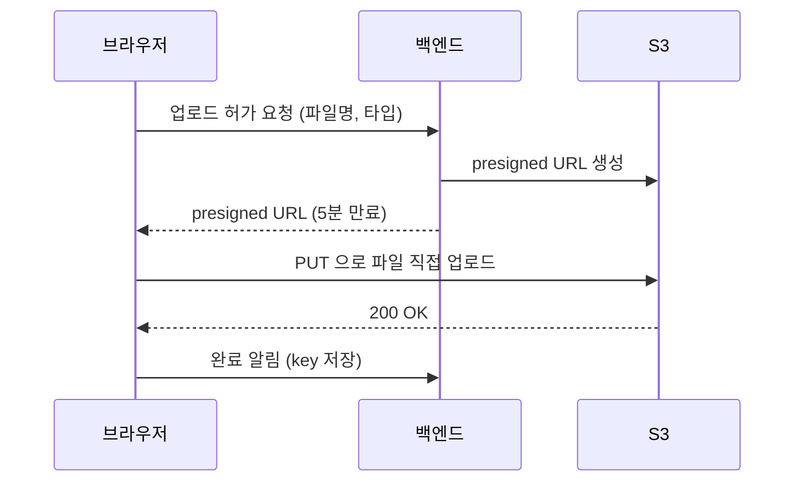

# **presigned URL 로 대용량 파일 업로드하기**
사용자가 파일을 올리는 기능을 만들 일이 생겼다. 처음엔 별거 아니라고 생각했다. 브라우저에서 `multipart/form-data` 로 파일을 보내고, 서버가 받아서 S3에 올리면 되는거 아닌가. 실제로 작은 파일은 그렇게 해도 잘 된다.

문제는 파일이 커지면서 시작됐다. 우리 백엔드는 Lambda로 돌아가는데, Lambda는 요청 본문 크기가 6MB로 제한된다. 6MB가 넘는 파일은 아예 서버로 받을수가 없다. 설령 일반 서버였어도, 파일을 서버 메모리로 받아서 다시 S3로 올리면 같은 데이터가 네트워크를 두 번 타고(브라우저 → 서버 → S3) 서버 메모리도 그만큼 먹는다. 큰 파일이 동시에 여러개 올라오면 서버가 휘청인다.

그래서 방향을 바꿨다. 서버는 파일을 직접 받지 않는다. 대신 브라우저가 S3로 직접 올리게 하고, 서버는 그 "허가증" 만 발급한다. 이 허가증이 presigned URL 이다.

## **presigned URL 이 뭐냐**
S3 버킷은 보통 비공개라 아무나 못 올린다. 그런데 S3에는 "이 키에, 이 방식으로, 언제까지 업로드해도 좋다" 는 걸 미리 서명해서 만든 URL을 발급하는 기능이 있다. 이게 presigned URL이다. 이 URL 하나만 있으면 AWS 자격증명 없이도 그 URL이 허락하는 딱 그 동작만 할수 있다.

흐름으로 보면 이렇다.

핵심은 파일 데이터가 서버를 안 거친다는 점이다. 서버는 "어디에 올려도 된다" 는 URL만 만들어 건네주고, 실제 업로드는 브라우저와 S3가 직접 한다. 서버 입장에선 무거운 파일을 만질 일이 없으니 메모리도 대역폭도 안 쓴다.

발급하는 쪽 코드는 간단하다. boto3 기준이다.

~~~python
import boto3
from uuid import uuid4

s3 = boto3.client("s3")

def create_upload_url(filename, content_type):
    # 키는 서버가 정한다. 사용자가 키를 마음대로 못 정하게.
    key = f"uploads/{uuid4()}/{filename}"
    url = s3.generate_presigned_url(
        "put_object",
        Params={
            "Bucket": BUCKET,
            "Key": key,
            "ContentType": content_type,
        },
        ExpiresIn=300,   # 5분. 짧게 잡는다
    )
    return {"url": url, "key": key}
~~~

브라우저는 받은 URL로 그냥 PUT을 날리면 된다.

~~~javascript
const { url, key } = await fetch("/api/upload-url", {
  method: "POST",
  body: JSON.stringify({ filename: file.name, contentType: file.type }),
}).then((r) => r.json());

await fetch(url, {
  method: "PUT",
  headers: { "Content-Type": file.type },
  body: file,
});

// 업로드가 끝났으면 key 를 서버에 저장한다 (어떤 레코드에 붙은 파일인지)
await fetch("/api/upload-complete", {
  method: "POST",
  body: JSON.stringify({ key }),
});
~~~

여기서 한가지 주의. 업로드할때 보낸 `Content-Type` 헤더가 presigned를 만들때 지정한 `ContentType` 과 정확히 일치해야 한다. 안 그러면 S3가 서명이 안 맞는다고 403을 뱉는다. 이거 모르고 헤더 빼먹었다가 한참 헤맸다.

## **진행률을 보여주려는데 fetch 가 안된다**
파일이 크면 사용자한테 진행률(프로그레스 바)을 보여줘야 한다. 그래야 멈춘건지 올라가는건지 안다. 근데 여기서 막혔다. `fetch` 는 업로드 진행 상황을 알려주는 이벤트가 없다. 다운로드(응답 받는 쪽)는 `ReadableStream` 으로 어찌어찌 되는데, 업로드(요청 보내는 쪽) 진행률은 표준적으로 잡을 방법이 없다.

그래서 이 부분만 옛날 방식인 `XMLHttpRequest` 로 돌아갔다. XHR에는 `upload.onprogress` 가 있어서 올라간 바이트를 알려준다.

~~~javascript
function uploadWithProgress(url, file, onProgress) {
  return new Promise((resolve, reject) => {
    const xhr = new XMLHttpRequest();
    xhr.open("PUT", url);
    xhr.setRequestHeader("Content-Type", file.type);

    xhr.upload.onprogress = (e) => {
      if (e.lengthComputable) {
        onProgress(e.loaded / e.total);   // 0.0 ~ 1.0
      }
    };

    xhr.onload = () => (xhr.status < 300 ? resolve() : reject(xhr.status));
    xhr.onerror = () => reject(new Error("network error"));
    xhr.send(file);
  });
}
~~~

요즘 세상에 XHR을 쓰는게 좀 그렇긴 한데, 업로드 진행률만큼은 아직 이게 제일 확실하다. 이런 자잘한 데서 표준이 덜 따라온 부분이 남아있다.

## **진짜 큰 파일은 멀티파트로 쪼갠다**
presigned PUT 한방으로 올리는건 깔끔하지만 한계가 있다. 단일 PUT으로 올릴수 있는건 최대 5GB고, 그 전에 현실적으로 네트워크가 한 번 끊기면 처음부터 다시 올려야 한다. 1GB 올리다가 90%에서 끊기면 다시 0부터다. 사용자 입장에선 끔찍하다.

그래서 큰 파일은 S3 멀티파트 업로드를 쓴다. 파일을 여러 조각(파트)으로 쪼개서 각각 따로 올리고, 다 올라가면 S3한테 "이 조각들 합쳐줘" 하는 방식이다. 조각별로 올리니까 병렬로 올릴수도 있고, 어떤 조각이 실패하면 그 조각만 다시 올리면 된다.

흐름이 좀 더 복잡해진다. 서버가 할 일이 세 단계가 된다.

1. 멀티파트 업로드 시작 → `UploadId` 를 받는다
2. 각 파트마다 presigned URL 발급
3. 브라우저가 다 올리고 나면, 파트들의 `ETag` 목록을 받아서 완료 처리

~~~python
def start_multipart(filename, content_type):
    key = f"uploads/{uuid4()}/{filename}"
    res = s3.create_multipart_upload(
        Bucket=BUCKET, Key=key, ContentType=content_type,
    )
    return {"key": key, "upload_id": res["UploadId"]}

def part_url(key, upload_id, part_number):
    return s3.generate_presigned_url(
        "upload_part",
        Params={
            "Bucket": BUCKET, "Key": key,
            "UploadId": upload_id, "PartNumber": part_number,
        },
        ExpiresIn=3600,
    )

def complete_multipart(key, upload_id, parts):
    # parts = [{"PartNumber": 1, "ETag": "..."}, ...]
    s3.complete_multipart_upload(
        Bucket=BUCKET, Key=key, UploadId=upload_id,
        MultipartUpload={"Parts": parts},
    )
~~~

그런데 "파일을 쪼갠다" 는게 뭔가 싶을수 있다. 파일은 결국 바이트의 연속이고, 쪼갠다는건 그 바이트 줄을 위치로 자르는 것뿐이다. 0~10MB가 1번 조각, 10~20MB가 2번 조각, 이런 식이다. 내용이 뭐든 상관없이 그냥 바이트 위치에서 뚝 자른다. 10MB 지점이 글자 중간이든 이미지 픽셀 중간이든 신경 안 쓴다. 어차피 나중에 순서대로 도로 이어붙이면 원본이 똑같이 복원되니까. 브라우저에선 `File.slice(start, end)` 가 이걸 하는데, 데이터를 복사하는게 아니라 "이 파일의 이 구간" 이라는 참조(Blob)만 만들어서 메모리 부담도 거의 없다.

재밌는건 파트를 올리는 순서가 상관없다는 점이다. 각 파트에 번호(1~10000)를 붙여서 올리는데, 이 번호가 곧 최종 위치다. 2번 3번을 먼저 올리고 1번을 맨 나중에 올려도 되고, 번호가 꼭 연속일 필요도 없다. S3는 마지막에 Complete 요청을 받았을때 비로소 번호 오름차순으로 조각들을 이어붙여 하나의 객체를 만든다. 도착 순서가 아니라 번호가 자리를 정하는 거다. 그래서 다음 섹션처럼 여러 조각을 병렬로 막 던져도 되는 거다.

코드로는 파일을 일정 크기로 잘라서(`File.slice`) 각 조각을 해당 파트 URL로 올린다. 파트 크기는 최소 5MB 제한이 있어서 보통 5~10MB로 잡는다. 그리고 각 PUT의 응답 헤더에 담겨오는 `ETag` 를 파트 번호와 함께 모아둬야 한다. 완료할때 이 목록이 필요하다.

~~~javascript
const PART_SIZE = 10 * 1024 * 1024;   // 10MB
const partCount = Math.ceil(file.size / PART_SIZE);

async function uploadPart(file, partNumber) {
  const start = (partNumber - 1) * PART_SIZE;
  const blob = file.slice(start, start + PART_SIZE);
  const url = await getPartUrl(partNumber);   // 서버에서 파트 URL 받기

  const res = await fetch(url, { method: "PUT", body: blob });
  const etag = res.headers.get("ETag");       // 완료 시 필요
  return { PartNumber: partNumber, ETag: etag };
}
~~~

여기서 `ETag` 를 브라우저 자바스크립트에서 읽으려면, S3(CORS) 설정에서 `ETag` 를 `ExposeHeaders` 에 넣어줘야 한다. 안 그러면 응답에 헤더는 와도 스크립트에서 못 읽는다. 이것도 한참 삽질한 부분이다. ETag가 자꾸 `null` 로 나와서 뭐가 문제인가 했다.

## **병렬로 올리되 너무 많이는 말고**
파트가 수십개면 한 번에 다 올리고 싶겠지만, 동시에 수십개를 다 던지면 브라우저랑 네트워크가 버거워한다. 그래서 동시 업로드 개수를 적당히(보통 3~5개) 제한하면서 올린다. 앞에서 [가상 스레드 글]()에서 동시성을 일부러 막던 얘기랑 비슷하다. "할수 있다" 와 "한꺼번에 다 해도 된다" 는 다르다.

~~~javascript
async function uploadAllParts(file, partCount, concurrency = 4) {
  const results = new Array(partCount);
  let next = 0;

  // 워커 N개가 파트 번호를 하나씩 집어가며 처리
  async function worker() {
    while (next < partCount) {
      const partNumber = ++next;   // 1부터
      results[partNumber - 1] = await uploadPart(file, partNumber);
    }
  }

  await Promise.all(
    Array.from({ length: concurrency }, () => worker())
  );
  return results;   // complete 에 넘길 ETag 목록
}
~~~

재시도도 이 단위에서 하면 깔끔하다. `uploadPart` 안에서 실패하면 그 파트만 두세번 다시 시도하고, 그래도 안되면 그때 전체를 실패 처리한다. 단일 PUT이었으면 1GB를 통째로 다시 올렸겠지만, 멀티파트라 실패한 10MB 조각만 다시 올리면 된다. 이게 멀티파트의 진짜 이점이다.

한 가지 빼먹기 쉬운게 있다. 파트만 올려놓고 Complete를 안 하면(사용자가 도중에 창을 닫거나 에러로 멈추면), 이미 올라간 조각들이 S3에 그대로 남는다. 객체 목록엔 안 보이는데 저장 용량으론 잡혀서 요금이 나간다. AWS 말로는 이런 미완성 멀티파트가 쌓이면 S3 저장 비용의 20%까지 차지하기도 한다더라. 보이지도 않는 조각들 때문에 돈이 새는거다. 그래서 버킷 lifecycle에 "N일 안에 완료 안된 멀티파트는 자동으로 중단(abort)" 규칙을 꼭 걸어둔다. 이건 멀티파트를 쓴다면 거의 필수 설정이다.

## **보안 - 허가증을 너무 헐겁게 만들지 않기**
presigned URL은 결국 "이거 가진 사람은 업로드 가능" 이라는 허가증(bearer 토큰)이다. URL만 있으면 AWS 자격증명 없이도 그 동작이 되니까, 만료 전에 이 URL이 유출되면 가진 사람 누구나 올릴수 있다. 편한 만큼 헐겁게 만들면 위험하다. 그래서 몇 가지를 챙겨야 한다.

- **만료를 짧게.** 짧을수록 좋다. 단일 업로드는 수십초에서 몇 분, 길어도 안 길게. 멀티파트 파트는 업로드에 시간이 걸리니 1시간 정도 잡는다. 어차피 발급은 업로드 직전이라 길게 잡을 이유가 없다.
- **키를 서버가 정한다.** 위 코드에서 키에 `uuid4()` 를 넣은 이유다. 사용자가 키(경로)를 마음대로 정하게 두면, 남의 파일 경로를 덮어쓰거나(같은 키면 덮어쓰기다) 엉뚱한 데 올릴수 있다. path traversal 같은 장난도 막아야 한다.
- **Content-Type 고정은 보안이 아니다.** presigned에 타입을 박아두면 그 헤더로만 올라가긴 하는데, 클라이언트가 헤더만 `image/png` 로 맞추면 실제 내용은 exe여도 통과한다. 즉 헤더 일치는 강제할수 있어도 "진짜 그 타입인지" 는 검증 못한다. 위장 파일을 막으려면 업로드 후에 봐야 한다.
- **악성 파일은 사후에 스캔한다.** 그래서 업로드 완료 후 S3 이벤트로 Lambda를 띄워서 파일을 검사하는 흐름을 둔다. 확장자/매직넘버를 확인하거나, 필요하면 바이러스 스캔을 건다. 올리는 순간을 막는게 아니라, 올라온 다음에 거른다.
- **크기 제한이 진짜 필요하면 PUT 말고 POST policy다.** 사실 PUT presigned는 구조상 크기를 제한할 방법이 없다. 업로드 크기를 꼭 막아야 한다면 `presigned POST`(POST policy)를 쓰는게 정석이다. POST policy는 조건에 `content-length-range` 를 넣어서 "0~10MB만 허용" 같은 제약을 S3가 강제하게 할수 있다. PUT으로 가되 굳이 막겠다면, 업로드 완료 후 `head_object` 로 실제 크기를 확인하고 너무 크면 지우는 차선책도 있다.

정리하면, presigned는 "올리는 순간" 을 서버가 직접 못 막는 모델이라, 통제를 두 군데로 나눠서 한다. 발급할때 조건을 빡세게(만료, 키, POST policy 제약) 걸고, 올라온 다음에 검증(크기, 내용, 스캔)한다. 이 두개를 제대로 하면 직접 업로드도 충분히 안전하게 굴릴수 있다.

## **정리**
- 파일은 서버로 받지 말고, presigned URL로 브라우저가 S3에 직접 올리게 한다. 서버 메모리/대역폭/페이로드 제한에서 자유로워진다.
- 업로드 진행률은 fetch로 안되니 XMLHttpRequest를 쓴다.
- 큰 파일은 멀티파트로 쪼갠다. 파일은 바이트 위치로 잘리고, 파트 번호가 자리를 정하니 순서 무관하게 병렬로 올려도 된다. 실패한 파트만 재시도. ETag는 CORS ExposeHeaders로 노출, 미완성 멀티파트는 lifecycle로 자동 중단을 걸어둔다.
- 허가증은 만료 짧게, 키는 서버가 결정한다. 크기 제한이 필요하면 POST policy, 위장/악성 파일은 업로드 후 스캔으로 거른다. (Content-Type 헤더 고정은 보안이 아니다)

참고로 이 방식이 좀 위험해 보일수도 있다. 서버를 안 거치고 브라우저가 S3에 직접 쓴다니까. 근데 이건 AWS가 공식으로 권장하는 표준 패턴이고, 대용량 파일을 다루는 서비스들 대부분이 이렇게 한다. 핵심은 위 보안 항목처럼 허가증에 제약을 제대로 거는 거다. 반대로 인증이나 권한 판단이 복잡해서 업로드 하나하나를 서버가 들여다봐야 하는 상황이라면, 옛날처럼 서버가 받아서 올리는 프록시 방식이 더 맞을수도 있다. presigned는 "대용량/대량을 서버 부담 없이 받자" 가 목적인 선택이지, 무조건 정답인건 아니다.

작은 파일이면 그냥 서버로 받아도 된다. 근데 파일이 커지거나 양이 많아지는 순간, 서버를 데이터 경로에서 빼는 이 구조가 확실히 편하다. 서버가 무거운 파일을 들고 끙끙대는 대신 허가증만 끊어주고 빠지는게, 두고 보니 여러모로 깔끔했다.
