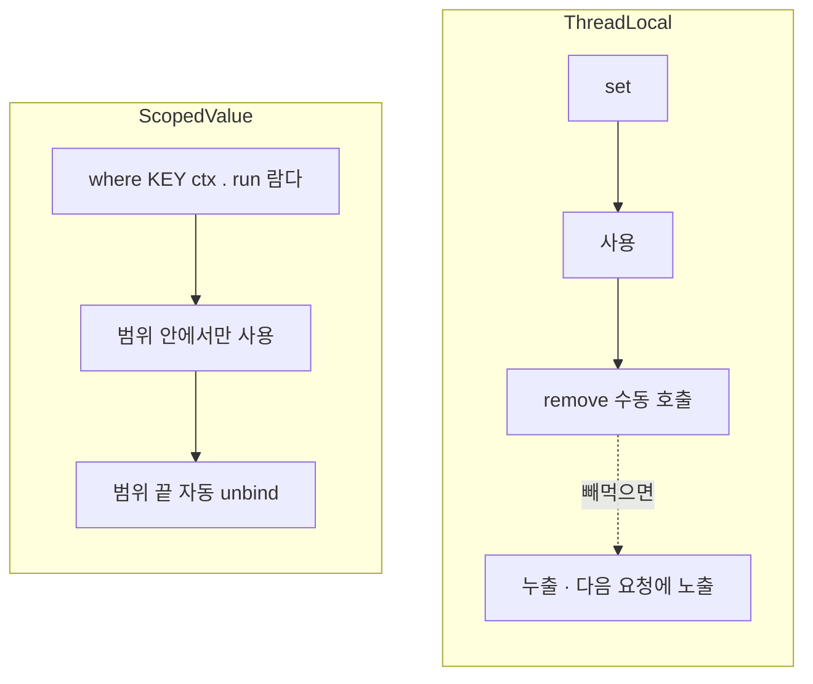

# **멀티테넌트 컨텍스트 전파하기**
여러 회사가 같이 쓰는 SaaS를 만들면, 데이터가 회사끼리 절대 섞이면 안된다는 게 제1원칙이 된다. A회사가 요청했는데 B회사 데이터가 조회되면 그건 버그가 아니라 사고다. 이걸 막는 방법으로 우리는 모든 테이블에 `company_id` 컬럼을 두고, 조회할 때마다 `WHERE company_id = ?` 를 붙이는 방식을 골랐다.

말은 간단한데 현실적인 문제가 하나 있다. **그 `company_id` 를 누가, 어떻게, 코드 전체에 전달하느냐** 다. 이 글은 그걸 ThreadLocal로 풀었다가, 결국 ScopedValue로 갈아탄 이야기다.

## **파라미터로 넘기면 지옥이다**
제일 먼저 떠오르는 방법은 파라미터로 넘기는 거다.

~~~java
documentService.search(companyId, query);

public List<Doc> search(String companyId, String query) {
    return documentRepository.findByCompany(companyId, query);
}
~~~

근데 이게 금방 지옥이 된다. 컨트롤러에서 받은 `companyId` 가 서비스로, 또 다른 서비스로, 리포지토리로... 호출 깊이만큼 모든 메서드 시그니처에 `companyId` 가 줄줄이 붙는다. 그리고 어디 한 군데서 깜빡 안 넘기면 그 순간 격리에 구멍이 뚫린다. "지금 몇 시냐" 를 알려고 모든 함수에 시각을 파라미터로 넘기지 않는 것처럼, 이런 "현재 요청의 맥락" 은 어딘가 담아두고 필요할 때 꺼내 쓰는 게 맞다.

(참고로 멀티테넌트 격리 자체는 DB 분리 / 스키마 분리 / 컬럼 구분 세 방식이 있는데, 우리는 회사가 수십~수백 곳 규모라 한 DB에서 `company_id` 컬럼으로 나누는 방식을 썼다. 제일 단순하고 효율적인 대신, 쿼리에서 `WHERE company_id` 를 빠뜨리면 바로 샌다. 그래서 그 값을 빠짐없이 일관되게 공급하는 게 중요하다.)

## **1차 — ThreadLocal**
정석은 ThreadLocal이다. 요청이 들어오는 맨 앞단(인터셉터)에서 "이 요청은 어느 회사냐" 를 알아내 ThreadLocal에 박아두고, 그 뒤로는 어디서든 꺼내 쓴다.

~~~java
public class TenantContext {
    private static final ThreadLocal<Company> HOLDER = new ThreadLocal<>();

    public static void setCompany(Company c) { HOLDER.set(c); }
    public static String getCompanyId() {
        var c = HOLDER.get();
        return c != null ? c.getId() : null;
    }
    public static void clear() { HOLDER.remove(); }
}

// 인터셉터 preHandle 에서 채우고, afterCompletion 에서 clear()
~~~

이러면 서비스/리포 어디서든 `TenantContext.getCompanyId()` 로 회사를 꺼낼 수 있다. 파라미터를 안 넘겨도 되고 시그니처가 깨끗해진다. 편하다. 근데 ThreadLocal은 편한 만큼 두 가지를 사람한테 떠넘긴다. 둘 다 크게 데였다.

## **함정 1 — 정리를 빼먹으면 다음 사람이 본다**
ThreadLocal은 "스레드" 에 값이 붙는다. 그런데 톰캣 같은 웹 서버는 요청마다 새 스레드를 만들지 않고 스레드 풀의 것을 재사용한다. A회사 요청을 처리한 스레드가 잠시 후 B회사 요청을 받을 수 있다.

이때 A 요청이 끝나고 컨텍스트를 안 비웠으면, 그 스레드엔 A회사 정보가 남는다. B 요청이 이 스레드에 배정되면 `getCompanyId()` 가 A회사를 돌려준다. **B회사 사용자가 A회사 데이터를 보게 된다.** 컬럼 구분 방식에서 제일 무서운 시나리오다.

그래서 요청 끝에 반드시 비워야 하는데, 이때 `set(null)` 이 아니라 `remove()` 를 써야 한다. `set(null)` 은 값만 null로 바꾸고 ThreadLocalMap 엔트리는 남겨서, 스레드가 안 죽고 재사용되는 풀에선 그게 쌓여 메모리 누수가 된다. 사소해 보이는데 실제로 흔한 사고다.

문제는 이 "비우기" 가 전적으로 개발자 책임이라는 거다. finally에서 remove를 빼먹으면 조용히, 그리고 위험하게 터진다.

## **함정 2 — 비동기로 넘어가면 컨텍스트가 증발한다**
이게 더 골치아팠다. ThreadLocal은 그 스레드 안에서만 유효하다. 작업을 다른 스레드로 넘기면(`@Async`, `CompletableFuture`, 별도 스레드풀) 그 새 스레드엔 컨텍스트가 없다.

우리는 검색을 병렬로 돌리는 코드가 있었다. 여러 소스를 동시에 조회하려고 `CompletableFuture` 로 작업을 스레드풀에 던졌는데, 워커 스레드에서 `getCompanyId()` 가 `null` 이 나왔다. 요청 스레드의 ThreadLocal이 워커까지 안 따라간 것이다. 운이 좋으면 NPE로 바로 터지고, 운이 나쁘면 `company_id = null` 로 조회가 나가 격리가 묘하게 깨진다. 후자가 훨씬 무섭다.

당시엔 Spring의 `TaskDecorator` 로 막았다. 작업을 제출하는 시점(요청 스레드)에 컨텍스트를 캡처해뒀다가, 워커 스레드에서 실행 직전 복원하고 끝나면 정리하는 방식이다. 동작은 하는데, 결국 함정 1과 같은 뿌리였다. ThreadLocal은 "어디까지 살아있어야 하는지" 를 스스로 모르니, 정리도 전파도 개발자가 일일이 챙겨줘야 한다.

## **2차 — ScopedValue 로 갈아타다**
얼마 뒤 운영 JDK를 25로 올리면서 ScopedValue로 옮겼다. ScopedValue는 JDK 25에서 정식이 된(JEP 506) ThreadLocal의 대안인데, 위 두 함정을 구조적으로 없앤다. 핵심 차이가 두 개다.

첫째, **값이 불변이고 유효 범위가 명확히 묶인다.** ThreadLocal처럼 아무 데서나 `set` 으로 바꾸는 게 아니라, "이 범위(람다) 안에서만 이 값이 유효" 라고 선언하고 그 범위가 끝나면 바인딩이 자동으로 사라진다. `remove()` 가 필요없다. 함정 1(정리 빼먹어서 누출)이 원천적으로 사라진다.

~~~java
public final class RequestContextHolder {
    private static final ScopedValue<RequestContext> SCOPED = ScopedValue.newInstance();

    public static RequestContext current() {
        if (!SCOPED.isBound()) {
            // 미바인딩 스레드에서 접근하면 조용히 null 이 아니라 즉시 예외 —
            // 격리가 깨진 채 흘러가는 것보다 바로 터지는 게 낫다.
            throw new IllegalStateException("RequestContext 미바인딩 스레드 접근");
        }
        return SCOPED.get();
    }
}
~~~

요청을 스코프로 감싸는 건 필터에서 한다. `where(...).call(...)` 로 요청 처리 전체를 감싸면, 그 안에서만 컨텍스트가 살아있고 `chain.doFilter` 가 반환되는 즉시 자동으로 풀린다.

~~~java
public class RequestContextScopeFilter extends OncePerRequestFilter {
    protected void doFilterInternal(HttpServletRequest req, HttpServletResponse res, FilterChain chain) {
        var ctx = new RequestContext();
        ScopedValue.where(RequestContextHolder.scopedValue(), ctx).call(() -> {
            chain.doFilter(req, res);   // 이 안에서만 ctx 유효
            return null;
        });
        // 여기 도달하면 ctx 는 이미 자동 unbind. finally 도, remove 도 없다.
    }
}
~~~

여기서 한가지 영리한 절충이 있다. ScopedValue는 불변이라 한번 바인딩하면 그 안에서 값을 못 바꾸는데, 우리는 인터셉터에서 "회사가 누구인지" 를 *나중에* 채워야 한다. 그래서 ScopedValue에는 비어있는 가변 홀더(`RequestContext`)를 바인딩해두고, 인터셉터가 그 홀더의 필드를 채우는 식으로 했다. ScopedValue가 "이 홀더 객체를 이 스코프에 고정" 하고, 그 안의 내용은 채워넣는 거다. 바인딩 자체는 불변이라 안전하고, 내용은 가변이라 유연하다.

둘째, **미바인딩 접근이 조용한 실패가 아니라 즉시 예외다.** ThreadLocal은 값이 없으면 `null` 을 돌려줘서, 격리가 깨진 줄도 모르고 `company_id = null` 로 쿼리가 나가버린다. ScopedValue는 바인딩 안 된 스레드에서 꺼내려 하면 바로 터진다. 위 `isBound()` 체크가 그거다. 필터나 데코레이터를 빠뜨린 스레드를 즉시 잡아낸다. 조용히 새는 것보다 시끄럽게 터지는 게 백배 낫다.

## **그래도 비동기는 다리가 필요하다**
ScopedValue가 비동기를 다 알아서 해주냐면, 절반만 그렇다. ScopedValue는 구조적 동시성(`StructuredTaskScope`)에서 `fork` 한 자식 작업엔 바인딩이 자동으로 상속된다. 값이 불변이라 부모-자식이 복사 없이 안전하게 공유할 수 있어서, ThreadLocal의 비싼 자식 상속 문제도 없다. 가상 스레드를 수만 개 띄우는 환경에서 특히 유리하다.

근데 우리가 쓰던 일반 `ExecutorService` 나 `CompletableFuture` 는 구조적 동시성이 아니라서, 여기엔 ScopedValue도 자동으로 안 넘어간다. 그래서 이 경로엔 여전히 다리를 놔줘야 하는데, ThreadLocal 때 쓰던 `TaskDecorator` 가 ScopedValue 버전으로 거의 그대로 살아남았다.

~~~java
@Component
public class RequestContextScopeTaskDecorator implements TaskDecorator {
    public Runnable decorate(Runnable runnable) {
        var snapshot = snapshot(RequestContextHolder.peek());   // 제출 시점 부모 컨텍스트 스냅샷
        // 자식 스레드에서 새 스코프를 열어 스냅샷을 바인딩 — 끝나면 자동 unbind
        return () -> ScopedValue.where(RequestContextHolder.scopedValue(), snapshot).run(runnable);
    }
}
~~~

차이가 있다면, ThreadLocal 때는 데코레이터 안에서 끝나고 직접 `clear()` 를 호출해 정리해야 했는데, ScopedValue 버전은 `run()` 이 끝나면 알아서 풀린다는 점이다. 정리 책임이 사라졌다. 그리고 스냅샷을 얕은 복사로 떠서 바인딩하니, 자식이 자기 컨텍스트를 바꿔도(예: 배치 작업이 다른 회사로 재지정) 부모 컨텍스트엔 영향이 없다.

## **두 방식 한눈에**
정리 책임이 어디 있는지가 핵심 차이다.

ThreadLocal은 set과 remove가 따로 떨어져 있어서, 그 사이 어디서 흐름이 끊기면 정리가 안 된다. ScopedValue는 값의 유효 범위가 람다 하나로 묶여있어서, 그 람다를 벗어나는 순간 무조건 풀린다. "정리를 잊을 수가 없는" 구조인 셈이다.

## **정리**
- 멀티테넌트에서 `company_id` 같은 요청 맥락은 파라미터로 돌리지 말고 컨텍스트에 담아 어디서든 꺼내 쓴다.
- ThreadLocal로 하면 두 가지를 직접 챙겨야 한다 — 요청 끝에 `remove()` 로 정리(안 하면 스레드 재사용 때문에 다음 요청에 노출), 비동기로 넘길 땐 `TaskDecorator` 로 전파.
- JDK 25의 ScopedValue는 이 둘 중 "정리" 를 구조적으로 없앤다. 값이 불변이고 범위가 람다에 묶여 자동 unbind 되며, 미바인딩 접근은 조용한 null이 아니라 즉시 예외다.
- 단 비동기는 여전히 절반만 자동이다. 구조적 동시성엔 자동 상속되지만, 일반 Executor/CompletableFuture엔 `TaskDecorator` 로 다리를 놔줘야 한다.

ThreadLocal은 "안 보이는 전역 변수" 라, 편한 대신 정리와 전파를 사람한테 떠넘긴다. ScopedValue는 그중 생명주기 관리를 언어가 가져갔다. 멀티테넌트처럼 컨텍스트가 새면 곧 사고인 곳에선, "잊을 수가 없는 구조" 라는 게 생각보다 큰 안전망이었다.
