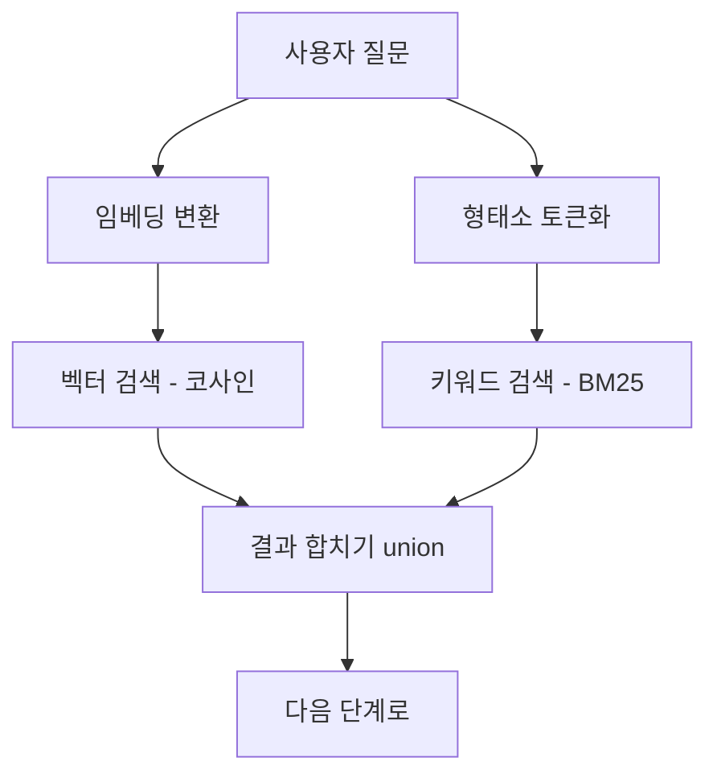

# **RAG 챗봇 벡터 검색 만들기**
회사에서 고객 문의에 자동으로 답하는 AI 챗봇을 만들게 됐다. 회사가 가진 문서나 FAQ를 바탕으로 답을 해주는, 요즘 흔히 말하는 RAG(Retrieval-Augmented Generation) 챗봇이다. 이름은 거창한데 핵심은 단순하다. 사용자가 질문하면, 우리 지식 중에서 그 질문과 관련있는 걸 찾아다가, 그걸 근거로 LLM이 답을 쓰게 하는 거다.

여기서 "관련있는 걸 찾는" 부분, 즉 검색이 RAG의 절반이다. LLM이 아무리 똑똑해도 엉뚱한 문서를 던져주면 엉뚱한 답이 나온다. 이 글은 그 검색을 어떻게 만들었는지에 대한 이야기다. 왜 벡터 검색이 필요했고, 벡터 DB는 뭘 골랐고(왜 pgvector였고), 그것만으론 왜 부족해서 키워드 검색까지 섞었는지를 정리한다.

## **왜 키워드 검색으로는 안되나**
처음엔 단순하게 생각했다. 질문에 들어간 단어로 문서를 검색하면(`LIKE '%환불%'` 같은) 되는거 아닌가. 근데 이게 금방 한계에 부딪힌다.

사용자가 "결제 취소하고 싶어요" 라고 물었는데, 우리 문서엔 "환불 절차" 라고만 적혀있으면? 단어가 하나도 안 겹친다. 키워드 검색은 이걸 못 찾는다. 사람은 "결제 취소 = 환불" 인걸 아는데, 글자만 비교하는 검색은 모른다. 의미가 같아도 표현이 다르면 놓치는 것이다. 챗봇에서 이건 치명적이다. 사용자는 우리 문서에 적힌 단어를 그대로 쓰지 않으니까.

그래서 필요한게 의미로 검색하는 방법이다. "결제 취소" 와 "환불" 이 의미가 가깝다는걸 아는 검색. 이게 벡터 검색이다.

## **벡터 검색이 뭐냐**
핵심 아이디어는 "텍스트를 의미를 담은 숫자 배열로 바꾸는" 것이다. 이 숫자 배열을 임베딩(embedding)이라고 부른다. 임베딩 모델에 문장을 넣으면, 예를 들어 1536개의 숫자로 된 벡터가 나온다. 이 벡터의 마법은, 의미가 비슷한 문장끼리는 벡터도 가깝게 나온다는 점이다.

그러니까 "결제 취소하고 싶어요" 와 "환불 절차" 를 각각 임베딩하면, 둘은 벡터 공간에서 가까이 위치한다. 반대로 "결제 취소" 와 "배송 조회" 는 멀리 떨어진다. 그럼 검색은 간단해진다. 사용자 질문을 임베딩한 다음, 우리가 미리 임베딩해둔 문서들 중에서 벡터가 가장 가까운 걸 찾으면 된다. 가깝다는걸 재는 척도로는 보통 코사인 유사도를 쓴다.

하나 덧붙이면, 문서를 통째로 임베딩하지는 않는다. 임베딩은 입력이 길든 짧든 똑같은 크기의 벡터 하나로 나온다. 그래서 긴 문서를 통째로 한 벡터에 욱여넣으면, 여러 내용이 한 점에 뭉뚱그려져서 특정 부분을 콕 집어 찾기가 어려워진다. 그래서 보통 문서를 적당한 크기(보통 수백 토큰)의 조각으로 쪼개서(청킹) 각 조각을 따로 임베딩한다. 이 청킹을 어떻게 하느냐도 검색 품질에 꽤 영향을 주는데, 그 얘기는 다음 편에서 더 하겠다.

이 "벡터를 저장하고, 가까운 벡터를 빠르게 찾는" 일을 해주는게 벡터 DB다. 그리고 벡터 DB는 종류가 꽤 많다.

## **벡터 DB 는 종류가 많다 - 언제 뭘 쓰나**
대표적인 것들만 봐도 이렇다.

- **Pinecone**: 완전 관리형(서버리스). 인프라를 아예 신경 안 쓰고 싶을때. 프로토타입이나, 운영에 손 대기 싫은 팀에 좋다. 대신 돈을 낸다.
- **Qdrant**: 필터링 검색이 빠르고 셀프호스팅하기 좋다. Rust로 만들어졌다.
- **Weaviate**: 키워드+벡터 하이브리드 검색이 내장돼있다. 관리형 클라우드도 있다.
- **Milvus**: 수억~수십억 벡터 규모를 다룰때. 샤딩/파티셔닝이 성숙하다.
- **pgvector**: PostgreSQL 확장. 이미 Postgres를 쓰고 있고, 벡터를 앱 데이터 옆에 두고 싶을때.

전용 벡터 DB들은 벡터를 다루려고 처음부터 설계된만큼, 큰 규모에서 강하다. 수천만, 수억 벡터를 다루거나, 벡터 워크로드를 따로 격리해서 안정적인 성능을 내야 한다면 전용 DB가 맞다. 인덱싱도 백그라운드나 분산으로 처리해서 일반 쿼리에 영향을 덜 준다.

근데 대부분의 회사는 처음부터 수억 벡터를 다루지 않는다. 우리도 그랬다.

## **왜 pgvector 를 골랐나**
우리는 이미 PostgreSQL을 메인 DB로 쓰고 있었다. 여기에 전용 벡터 DB를 새로 들이는건 생각보다 큰 일이다. 운영할 인프라가 하나 늘고, 앱에서 DB로 가는 네트워크 홉이 하나 더 생기고, 팀이 새 도구를 배워야 하고, 배포 파이프라인도 손봐야 한다. 검색 기능 하나 붙이자고 치르기엔 비용이 작지 않다.

pgvector는 이걸 다 건너뛴다. PostgreSQL에 확장 하나 설치하면 끝이고, 벡터가 기존 관계형 데이터랑 같은 DB에 산다. 이게 의외로 큰 장점인데, 예를 들어 "문서를 수정하면 그 임베딩도 같이 갱신" 하는 작업을 하나의 트랜잭션으로 묶을수 있다. 데이터와 벡터가 따로 놀다가 어긋나는 사고가 안 난다.

성능도 생각보다 충분하다. pgvector는 HNSW 인덱스(아래에서 설명)를 쓰면 백만 벡터 규모에선 전용 DB와 비등하거나 더 나은 벤치마크도 있다. 우리처럼 회사(테넌트)별로 데이터가 나뉘고 테넌트당 벡터가 수만~수십만 수준이면, 검색이 수십 밀리초 안에 안정적으로 끝난다. 차고 넘친다.

그래서 결론은 "기술적으로 뭐가 제일 빠르냐" 가 아니라 "우리 상황에 뭐가 맞냐" 였다. 이미 Postgres가 있고 규모가 아직 작다면 pgvector로 시작하는게 합리적이다. 나중에 수억 벡터로 커지면 그때 전용 DB로 옮기면 된다. 실제로 그 시점(보통 수천만 벡터, 혹은 클라우드 비용이 부담될 때)에 옮기는게 흔한 경로다.

## **pgvector 기본 - 테이블과 인덱스**
pgvector를 설치하면 `vector` 라는 타입이 생긴다. 임베딩 차원만큼 크기를 정해서 컬럼을 만든다.

~~~sql
CREATE TABLE knowledge (
    id          UUID PRIMARY KEY DEFAULT gen_random_uuid(),
    company_id  VARCHAR(36) NOT NULL,   -- 멀티테넌트 격리 키
    service_id  VARCHAR(36),            -- 회사 안의 서비스 단위 (없으면 회사 공용)
    content     TEXT,
    embedding   vector(1536)            -- 임베딩 모델이 내는 차원에 맞춘다
);
~~~

검색은 거리 연산자로 한다. pgvector에서 `<=>` 가 코사인 거리다. 거리가 작을수록 가깝다(유사도가 높다). 그래서 `1 - 거리` 를 유사도로 본다.

~~~sql
SELECT content, 1 - (embedding <=> :queryVec) AS similarity
FROM knowledge
WHERE company_id = :companyId
ORDER BY embedding <=> :queryVec   -- 가까운 순
LIMIT 10;
~~~

근데 이대로면 모든 행과 일일이 거리를 계산하는 풀스캔이라, 데이터가 많아지면 느려진다. 그래서 인덱스가 필요한데, 여기서 한번 골라야 한다.

## **HNSW 냐 IVFFlat 이냐**
pgvector의 벡터 인덱스는 두 종류다. HNSW와 IVFFlat인데, 성격이 다르다.

- **IVFFlat**: 벡터들을 미리 여러 묶음(리스트)으로 나눠두고, 검색할때 질문과 가까운 몇 개 묶음만 뒤진다. 인덱스 만드는게 빠르다(HNSW의 5~6배). 대신 검색 성능이나 정확도(recall)는 HNSW보다 좀 떨어진다. 그리고 묶음을 나누려면 데이터가 어느정도 있어야 해서, 데이터를 넣기 전엔 인덱스를 못 만든다.
- **HNSW**: 벡터들을 그래프로 연결해두고 그 그래프를 타고 가까운 걸 찾는다. 인덱스 만드는건 느리지만(인덱스 생성할때만 그렇다), 검색이 빠르고 정확도가 높다. 메모리는 더 먹는다. 데이터가 없어도 인덱스를 미리 만들어둘수 있다.

요즘 RAG나 시맨틱 검색에선 대체로 HNSW가 안전한 기본값이다. 튜닝할 게 적고, 실시간으로 데이터가 들락거리는 상황에 잘 버티고, 정확도가 높다. 우리도 HNSW로 갔다.

사실 처음엔 인덱스 만드는게 빠르다는 IVFFlat을 잠깐 봤었다. 근데 우리 챗봇은 회사들이 문서를 수시로 올리고 지워서 데이터가 계속 들락거리는데, IVFFlat은 묶음을 나누려고 데이터가 어느정도 쌓여있어야 하고, 중간에 데이터 분포가 바뀌면 인덱스를 다시 만들어주는게 번거로웠다. 반면 HNSW는 빈 테이블에도 인덱스를 미리 만들어두고 데이터가 들어오는 대로 그래프에 붙는다. 우리처럼 데이터가 유동적인 패턴엔 이쪽이 훨씬 편했다. 빌드가 좀 느린건 어차피 인덱스 만들 때 한 번뿐이라 신경 쓸 일이 아니었다.

~~~sql
CREATE INDEX ON knowledge
USING hnsw (embedding vector_cosine_ops);   -- 코사인 거리용 인덱스
~~~

`vector_cosine_ops` 가 코사인 거리 기준으로 인덱스를 만든다는 뜻이다. 검색할때 쓰는 거리(`<=>`, 코사인)랑 인덱스의 거리 기준이 일치해야 인덱스를 탄다. 이거 안 맞춰서 인덱스를 안 타고 풀스캔하는 실수가 흔하다.

## **멀티테넌트 - 한 테이블에 여러 회사**
우리 챗봇은 여러 회사가 같이 쓰는 형태라, 회사끼리 데이터가 절대 섞이면 안된다. A 회사가 질문했는데 B 회사의 문서가 검색되면 큰일이다. 전용 벡터 DB는 보통 네임스페이스 같은걸로 이걸 나누는데, pgvector에선 그냥 컬럼으로 한다. 위 테이블에 `company_id` 를 둔게 그거다.

검색할때 항상 `WHERE company_id = ?` 를 붙여서 그 회사 데이터만 본다. 회사 안에서도 서비스 단위로 더 나누고 싶으면 `service_id` 까지 건다. 단순하지만 확실하다. 관계형 DB의 익숙한 방식 그대로 테넌트를 나눌수 있다는것도 pgvector를 쓰는 또다른 이점이었다.

`(company_id, service_id)` 복합 인덱스를 같이 걸어두면, 벡터 검색 전에 테넌트로 후보를 먼저 좁힐 수 있어서 도움이 된다.

## **임베딩 모델은 함부로 못 바꾼다**
벡터 검색을 운영하다 한번 크게 데인 함정이 있다. 검색이 제대로 되려면, 문서를 인덱싱할 때 쓴 임베딩 모델과 질문을 임베딩할 때 쓴 모델이 같아야 한다. 모델이 다르면 벡터가 놓이는 공간 자체가 달라서, 코사인 유사도가 의미를 잃는다. 같은 "환불" 이라는 단어라도 모델 A가 만든 벡터와 모델 B가 만든 벡터는 완전히 다른 좌표에 찍힌다.

문제는 임베딩 모델을 더 좋은걸로 바꾸고 싶을 때다. 모델을 바꾸면 이미 저장해둔 문서 벡터 전부를 새 모델로 다시 임베딩해서 갈아끼워야 한다(재인덱싱). 안 그러면 옛 모델로 만든 문서 벡터와 새 모델로 만든 질문 벡터를 비교하게 돼서, 데이터가 멀쩡히 있는데도 검색이 0건 나오는 황당한 일이 생긴다. 차원이 다른 모델로 바꾸면 아예 저장도 안되니 그나마 바로 알아채는데, 차원이 같으면 에러도 없이 조용히 품질만 망가져서 더 무섭다.

그래서 우리는 각 벡터에 "어떤 모델로 만든 벡터인지" 를 같이 저장해뒀다. 검색할 땐 현재 모델과 다른 모델로 만든 벡터는 아예 제외하고, 혹시 검색이 0건이면 "다른 모델로 인덱싱된 벡터가 남아있는건 아닌가" 를 로그로 경고하게 했다. 모델을 바꾸고 재인덱싱을 깜빡하는 사고를 곧장 잡아내려는 장치다.

## **벡터 검색만으론 부족하다 - BM25 를 섞다**
벡터 검색을 붙이고 한동안은 만족했는데, 운영하다 보니 자꾸 못 찾는 패턴이 보였다. 바로 고유명사나 신조어, 특정 코드 같은 거다.

벡터 검색은 의미를 잘 잡는 대신, 정확한 단어 매칭엔 의외로 약하다. 예를 들어 회사 고유의 메뉴 이름이나 상품 코드, 에러 코드 같은걸 사용자가 정확히 쳤는데, 벡터 검색은 "그거랑 의미가 비슷해 보이는" 엉뚱한 문서를 가져온다. 임베딩 모델 입장에선 처음 보는 신조어라 의미를 모르니, 대충 비슷한 자리에 던져버리는 것이다.

재밌는건 이게 옛날 키워드 검색이 잘하던 영역이라는 점이다. 그래서 둘을 같이 쓰기로 했다. 이걸 하이브리드 검색이라고 부른다. 두 방식의 약점이 서로 정반대라 잘 맞물린다.

- **벡터 검색**: 의미/패러프레이즈에 강함. 정확한 토큰엔 약함.
- **키워드 검색(BM25)**: 희귀하고 정확한 단어(코드, 고유명사)에 강함. 의미는 모름.

PostgreSQL은 사실 full-text search 기능을 원래 갖고 있다. `tsvector` 로 문서를 토큰화해두고, `ts_rank_cd` 로 관련도 점수를 매긴다. 그래서 벡터용 컬럼 옆에 키워드 검색용 컬럼을 하나 더 둔다.

여기서 한가지 정확히 짚어둘게 있다. PostgreSQL 기본 `ts_rank_cd` 는 엄밀히 말하면 BM25 그 자체는 아니다. BM25는 흔한 단어보다 희귀한 단어에 가중치를 더 주고(IDF), 문서 길이로 점수를 보정하는 등 코퍼스 전체의 통계를 쓰는 알고리즘이다. 반면 Postgres 기본 랭킹은 그 문서 안에서의 단어 빈도와 단어 사이 거리 정도만 본다. 그래서 진짜 BM25가 필요하면 `pg_search` 같은 별도 확장을 쓴다. 다만 우리한테 필요했던건 "정확한 단어가 든 문서를 점수 매겨 찾는" 키워드 검색이었고, 그 역할은 Postgres 기본 기능으로 충분했다. 그래서 확장 없이 `tsvector` 로 갔다. (편의상 BM25라 부르지만 정확히는 BM25 스타일의 키워드 검색이라고 보면 된다)

~~~sql
ALTER TABLE knowledge ADD COLUMN content_tsv tsvector;
CREATE INDEX ON knowledge USING gin (content_tsv);   -- 키워드 검색용 GIN 인덱스
~~~

키워드 검색 쿼리는 이렇게 생겼다.

~~~sql
SELECT content, ts_rank_cd(content_tsv, query, 32) AS rank
FROM knowledge, to_tsquery('simple', :tokens) AS query
WHERE company_id = :companyId
  AND content_tsv @@ query   -- 토큰이 매칭되는 문서만
ORDER BY rank DESC
LIMIT 10;
~~~

한국어는 띄어쓰기로 단어가 깔끔하게 안 나뉘어서, 토큰화에 형태소 분석기(우리는 nori 계열을 썼다)를 한번 거친다. "환불받고싶어요" 를 "환불 / 받 / 싶" 같은 의미 단위로 쪼개서 매칭률을 올리는 것이다.

## **둘을 합치면**
정리하면 검색이 이렇게 흘러간다. 사용자 질문 하나가 들어오면, 한쪽에선 임베딩으로 바꿔 벡터 검색을, 다른 쪽에선 형태소로 쪼개 키워드 검색을 동시에 돌린다. 그리고 두 결과를 합친다(union).

의미로도 찾고 정확한 단어로도 찾으니, 한쪽이 놓치는걸 다른 쪽이 줍는다. 실제로 하이브리드로 바꾸고 나서 "분명 문서에 있는데 못 찾던" 케이스가 눈에 띄게 줄었다.

그런데 두 검색 결과를 그냥 합치기만 하면, 순서(어떤게 더 관련있나)가 뒤죽박죽이다. 벡터 점수와 키워드 점수는 척도가 달라서 단순 비교가 안된다. 그래서 합친 다음에 다시 한번 줄을 세우는 단계가 필요하다. 이걸 리랭킹(reranking)이라고 하는데, 여기에 더해 진짜 관련있는지를 LLM이 직접 판단하게 하는 장치까지 붙였다. 이 뒷부분은 글이 길어지니 다음 편에서 따로 다루겠다.

## **정리**
- RAG의 절반은 검색이다. 키워드만으로는 표현이 다른 질문을 놓치니, 의미로 찾는 벡터 검색이 필요하다.
- 벡터 DB는 종류가 많지만, 이미 Postgres를 쓰고 규모가 수백만 벡터 이하라면 pgvector가 합리적이다. 인프라를 안 늘리고 트랜잭션 일관성을 얻는다.
- 인덱스는 대체로 HNSW가 안전한 기본값이다. 검색 거리와 인덱스 거리 기준(코사인)을 맞춰야 인덱스를 탄다.
- 멀티테넌트는 `company_id` 컬럼과 `WHERE` 로 나눈다. 관계형의 익숙한 방식이 그대로 통한다.
- 임베딩 모델을 바꾸면 저장된 벡터 전부를 재인덱싱해야 한다. 벡터에 모델 정보를 같이 저장해두면 깜빡한 사고를 일찍 잡는다.
- 벡터 검색은 정확한 단어에 약하니, 키워드 검색(BM25 스타일)을 섞은 하이브리드로 약점을 메운다.

벡터 검색이라고 하면 뭔가 거창한 전용 인프라가 있어야 할 것 같지만, 막상 해보니 우리 규모에선 늘 쓰던 PostgreSQL 위에서 다 됐다. 새 도구를 들이기 전에, 지금 쓰는 DB가 어디까지 해주는지 보는게 먼저인것 같다.
