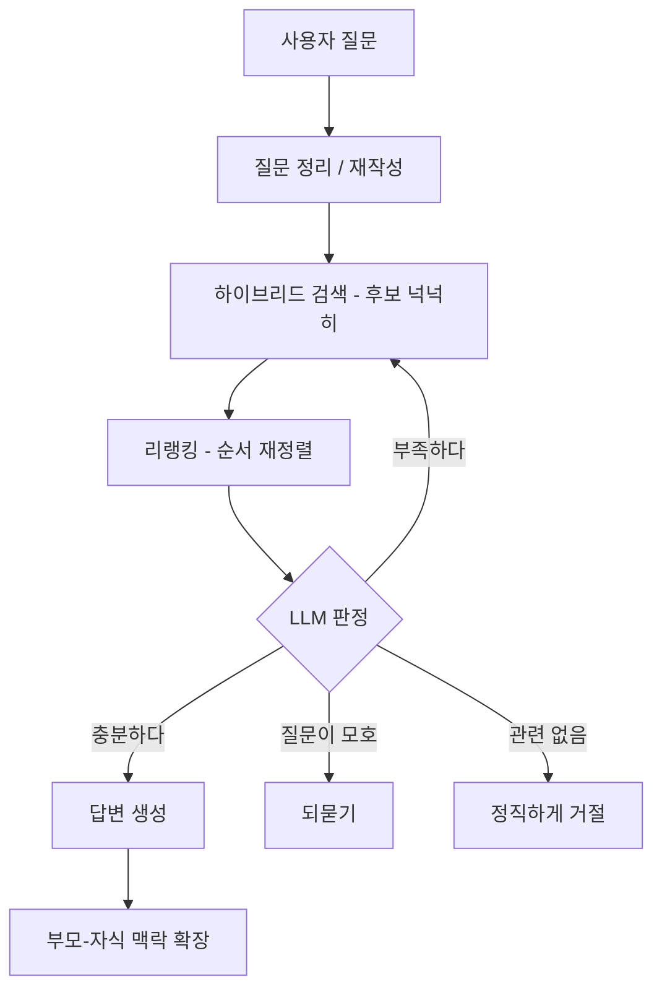
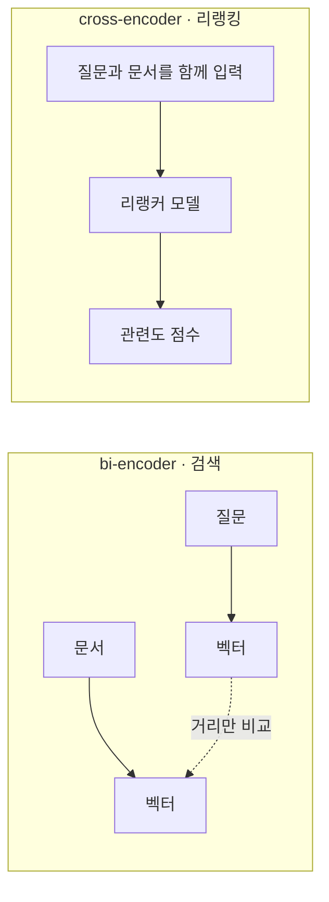

# **RAG 검색 품질 끌어올리기**
[지난 글]()에서 pgvector로 벡터 검색을 붙이고, 거기에 키워드 검색까지 섞은 하이브리드를 만들었다. 의미로도 찾고 정확한 단어로도 찾으니 후보를 빠짐없이 긁어오게 됐다. 근데 운영해보니 "후보를 잘 긁어온다" 와 "좋은 답이 나온다" 는 생각보다 거리가 멀었다.

문제는 이거였다. 하이브리드 검색이 후보를 20개쯤 가져오는데, 그 20개의 순서가 엉망이었다. 진짜 정답인 문서가 12번째에 깔려있고, 어중간하게 비슷한 문서가 1번에 올라와 있는 식이다. RAG는 보통 상위 몇 개만 LLM에 넘기니까, 정답이 12번째면 아예 안 보여진다. 검색은 됐는데 답은 틀리는 것이다.

이 글은 그 다음 이야기다. 긁어온 후보를 어떻게 다듬어서 진짜 쓸만한 걸 골라내는지. 검색이 "찾기" 라면, 이 글은 "찾은 걸 줄 세우고 판단하기" 에 대한 거다.

## **전체 흐름**
먼저 우리가 만든 검색 파이프라인 전체를 그려보면 이렇다.

검색(하이브리드)은 가운데 한 단계일 뿐이고, 앞뒤로 질문을 다듬고, 결과를 줄 세우고, 판단하는 단계가 붙는다. 하나씩 보겠다.

## **질문부터 다듬는다 - 재작성과 확장**
사용자는 검색에 좋은 형태로 질문하지 않는다. "그거 안돼요" 같은 말이 그냥 들어온다. 이걸 그대로 임베딩해서 검색하면 당연히 못 찾는다. 그래서 검색 전에 질문을 한번 손본다. 두 가지 방향이 있다.

하나는 재작성(rewriting)이다. 앞뒤 대화 맥락을 봐서 "그거 안돼요" 를 "주문 취소가 안 되는 이유" 같은 자기완결적인 질문으로 바꾼다. 특히 멀티턴 대화에서 중요하다. "1번이요" 같은 답을 그대로 검색하면 의미가 없으니, 직전에 뭘 물었는지를 합쳐서 온전한 질문으로 만들어줘야 한다.

다른 하나는 확장(expansion)이다. 같은 의미의 다른 표현이나 관련어를 더해서 검색어를 여러개로 늘린다. "환불" 하나로만 찾던걸 "환불 / 결제 취소 / 반품" 으로 늘려서 각각 검색하고 합치는 식이다. 이러면 한 표현으로는 놓쳤을 문서를 줍는다. 검색 결과의 양(recall)이 늘어난다.

우리는 이 둘을 같이 한다. 질문 하나를 받으면 재작성한 버전과 확장한 변형 몇 개를 만들어서, 각각 검색을 돌리고 결과를 합친다. 변형마다 임베딩을 따로 해야 하니, 이건 병렬로 처리해서 시간을 줄였다.

## **리랭킹 - 순서를 제대로 다시 매긴다**
이제 검색 결과를 줄 세울 차례다. 왜 다시 줄을 세워야 하냐면, 앞에서 말한 "정답이 12번째" 문제 때문이다. 여기엔 좀 더 근본적인 이유가 있다.

벡터 검색에 쓰는 임베딩은 질문과 문서를 따로따로 벡터로 만든다(bi-encoder). 각자 벡터를 만들어두고 거리만 재니까 빠르긴 한데, 질문과 문서를 같이 놓고 꼼꼼히 비교하진 못한다. 그래서 "대충 비슷한" 건 잘 잡아도 "이게 진짜 그 질문의 답인가" 는 놓치기 쉽다.

리랭킹(reranking)은 여기에 한 단계를 더 둔다. 리랭커는 cross-encoder라고 해서, 질문과 후보 문서를 한꺼번에 넣고 둘 사이를 직접 비교한다. 질문의 단어 하나하나와 문서의 단어 하나하나가 어떻게 맞물리는지를 본다. 느리지만 훨씬 정확한 관련도 점수가 나온다.

차이는 입력에 있다. 검색용 임베딩(bi-encoder)은 질문과 문서를 따로따로 벡터로 만들어두고 거리만 잰다. 그래서 미리 문서를 다 벡터로 만들어둘 수 있어서 빠르다(검색에 적합). 반면 리랭커(cross-encoder)는 질문과 문서를 한 쌍으로 같이 넣어서 그 자리에서 점수를 뽑는다. 미리 계산해둘 수가 없어서 느리지만, 둘을 직접 비교하니 정확하다. 그래서 빠른 bi-encoder로 후보를 좁히고, 정확한 cross-encoder로 그 안을 줄 세우는 역할 분담이 자연스럽게 나온다.

그래서 보통 이렇게 쓴다. 검색으로 후보를 넉넉히(우리는 20개쯤) 긁어온 다음, 그걸 통째로 리랭커에 넣어서 다시 점수를 매기고, 점수 높은 순으로 정렬한다. 빠른 검색으로 후보를 좁히고, 느리지만 정확한 리랭커로 그 안에서 순서를 잡는 2단 구조다. 우리는 리랭커로 외부 서비스(이쪽 분야에 특화된 모델을 API로 제공한다)를 가져다 썼는데, 이것만 붙여도 "정답이 12번째" 던게 1~2번으로 올라오는 경우가 확 늘었다.

여기서 한가지 더. 하이브리드 검색 결과는 벡터 점수랑 키워드 점수가 척도가 달라서 그냥 섞으면 순서를 못 매긴다. 리랭킹은 이 둘을 같은 기준으로 다시 점수 매겨주니까, 하이브리드와 특히 잘 맞는다. 서로 다른 검색에서 온 후보들을 하나의 줄로 세워주는 역할도 하는 셈이다.

물론 리랭킹도 만능은 아니다. cross-encoder는 후보 하나하나를 질문과 같이 다시 돌려야 해서 느리다. 측정해보면 검색 파이프라인 전체 지연의 상당 부분을 리랭킹이 차지하기도 해서, 응답 속도가 중요한 챗봇에선 부담이 된다. 그리고 요즘 LLM들은 자료의 순서에 예전만큼 민감하지 않아서, 순서를 완벽히 잡는 이득이 생각보다 작을 때도 있다. 무엇보다, 리랭킹은 "어떤 자료를 보여줄지" 를 정할 뿐 그 자료로 LLM이 헛소리하는 것까지 막아주진 못한다. 순서를 잘 매겨놔도, 1등 자료가 질문이랑 맥락만 비슷하고 정작 답의 근거는 아닐 수 있다. 그래서 한 단계가 더 필요하다.

## **점수로 자르지 말고, LLM 이 판단하게**
리랭킹까지 하면 순서는 좋아진다. 근데 또 다른 문제가 있다. "그래서 이 후보들이 진짜 답이 될 만한가" 는 순서랑 별개다.

흔히 하는 방식은 점수 컷을 두는 거다. "리랭킹 점수 0.7 넘는 것만 쓰자" 같은. 근데 이게 영 애매했다. 컷을 높게 잡으면 멀쩡한 답을 잘라버리고(놓침), 낮게 잡으면 엉뚱한 문서가 통과해서 LLM이 그걸로 헛소리를 한다. 회사마다, 질문마다 적정 점수가 달라서 하나의 숫자로 못 박았다.

그래서 방향을 바꿨다. 점수로 거르는 대신, 점수 기준은 아주 낮게(놓치지 않는 데 집중) 잡아서 후보를 넉넉히 남기고, "이게 진짜 관련있는지" 의 최종 판단은 LLM한테 맡겼다. 후보 목록을 LLM에 주고 "이 질문에 이 자료들로 답할 수 있냐" 를 묻는 것이다. 사람이 보면 0.1초에 판단할 걸, 점수라는 간접 지표 대신 LLM의 의미 이해로 직접 판단하게 한 거다.

이 판정 LLM은 단순히 "관련있다/없다" 만 답하지 않고, 몇 갈래로 나눠서 답하게 했다.

- **충분하다**: 이 자료로 답할 수 있다. 답변 생성으로 넘어간다.
- **부족하다**: 방향은 맞는데 자료가 모자라다. 검색어를 새로 만들어 한 번 더 검색한다(재검색).
- **질문이 모호하다**: 무슨 말인지 애매하다. 사용자에게 되묻는다.
- **관련 없다**: 우리 지식에 없는 질문이다. 모른다고 정직하게 답한다.

코드로 옮기면 대략 이런 모양이다. 점수 임계값으로 가르는 if문 대신, LLM의 판정이 흐름을 가른다.

~~~python
for hop in range(MAX_HOPS):                  # 재검색 한도
    candidates = retrieve(search_queries)    # 하이브리드 검색 + 리랭킹
    verdict = judge(question, candidates)    # LLM 이 후보를 보고 판정

    if verdict.kind == "ENOUGH":             # 충분 — 이 자료로 답 가능
        selected = verdict.selected
        break
    elif verdict.kind == "RETRY":            # 부족 — 검색어 바꿔 한 번 더
        search_queries = [verdict.next_query]
        continue
    elif verdict.kind == "ASK":              # 모호 — 되묻기
        return clarify(verdict.ask_message)
    else:                                    # NONE — 관련 없음, 정직하게 거절
        return refuse()
~~~

이렇게 LLM이 흐름을 정하게 하니, "검색 → 무조건 답 생성" 이던 뻣뻣한 파이프라인이 상황에 따라 재검색하거나 되묻거나 거절하는 유연한 흐름이 됐다. 특히 마지막 "관련 없으면 정직하게 거절" 이 중요했다. 어설픈 후보로 그럴듯한 거짓말(환각)을 하느니, 모른다고 하는 게 챗봇 신뢰엔 훨씬 낫다.

재검색은 무한정 돌면 안되니 한도를 뒀다. 첫 검색에서 부족하면 딱 한 번 더 검색하고, 그래도 부족하면 있는 후보로 답을 시도하거나 거절한다. 안 그러면 LLM이 "조금만 더, 조금만 더" 하면서 비용과 시간을 무한히 쓸 수 있다.

## **작게 찾고, 크게 읽는다 - 부모-자식 청킹**
마지막 한 조각. 지난 글에서 "문서를 청크로 쪼개 임베딩한다" 고 했는데, 이 청크 크기가 묘한 딜레마를 만든다.

청크를 작게 쪼개면 검색은 정밀해진다. 한 청크에 하나의 내용만 담기니까, 질문이랑 딱 맞는 조각을 콕 집어낸다. 근데 막상 그 작은 조각만 LLM한테 주면, 답을 쓰기엔 맥락이 부족하다. 예를 들어 어떤 절차의 3단계만 검색됐는데, 1~2단계가 안 딸려오면 LLM이 전체 절차를 설명 못한다.

반대로 청크를 크게 쪼개면 맥락은 풍부한데, 한 청크에 여러 내용이 섞여서 검색 정밀도가 떨어진다.

그래서 둘을 분리했다. 검색은 작은 청크로 하고, 답을 쓸 때는 큰 맥락을 준다. 작은 청크로 정확히 찾은 다음, 그 청크가 속한 원본 문서에서 앞뒤로 인접한 형제 청크들을 같이 묶어서 LLM한테 넘기는 것이다. "작게 찾고, 크게 읽는다(small-to-search, big-to-read)" 는 패턴이다. 검색의 정밀함과 생성의 풍부함을 둘 다 가져가는 방법이다.

## **공짜가 아니다**
여기까지가 우리 검색 파이프라인이다. 질문 재작성, 변형 확장, 하이브리드 검색, 리랭킹, LLM 판정, 맥락 확장. 후보를 단순히 긁어오던 데서 시작해 꽤 여러 단계가 붙었다.

근데 솔직히 말하면, 이게 공짜가 아니다. 질문 하나를 처리하는데 LLM을 여러 번 부른다. 질문을 정리하는 데 한 번, 관련성을 판정하는 데 한 번(재검색하면 또), 답을 생성하는 데 한 번, 거기에 임베딩과 리랭킹 API 호출까지. 단계를 더할수록 답은 좋아지지만, 응답이 느려지고 비용이 올라간다.

그리고 모든 질문에 이 풀코스를 다 돌릴 필요도 없다. "운영시간 언제예요" 같은 단순한 질문까지 재작성하고 재검색하고 판정하는 건 과하다. 단순한 질문은 가볍게 처리하고, 여러 단계를 엮어야 답이 나오는 복잡한 질문에만 풀 파이프라인을 태우는 식으로 나누면 평균 비용이 확 준다. 판정을 맡긴 LLM도 완벽하진 않아서 나름의 편향이 있으니, 그 판정이 맞는지까지 평가 세트로 같이 봐야 하고.

그래서 이런 단계는 무작정 다 넣는 게 아니라, 하나 붙일 때마다 "이게 정말 답 품질을 올리나" 를 따져봐야 한다. 우리는 단계마다 걸린 시간을 다 기록해두고, 평가용 질문 세트로 "이 단계를 넣었더니 점수가 얼마나 올랐나" 를 보면서 결정했다. 안 그러면 그럴듯해 보이는 단계만 잔뜩 쌓여서, 느리고 비싸기만 한 파이프라인이 되기 쉽다. 정교함은 측정으로 떠받쳐야 한다.

## **정리**
- 검색이 후보를 잘 긁어와도 순서와 관련성은 별개다. "찾기" 다음에 "다듬기" 가 필요하다.
- 사용자 질문은 검색 전에 재작성/확장으로 손본다. 특히 멀티턴에선 자기완결 질문으로 바꿔야 한다.
- 리랭킹(cross-encoder)으로 후보의 순서를 다시 매긴다. 하이브리드 결과를 하나의 줄로 세우는 역할도 한다.
- 점수로 자르지 말고, 관련성의 최종 판단은 LLM에 맡긴다. 충분/부족/모호/없음으로 흐름을 가른다.
- 작은 청크로 정밀하게 찾고, 답 쓸 땐 인접 맥락을 묶어 크게 읽는다.
- 이 모든 단계는 비용이다. 측정으로 정당화하지 못하는 단계는 빼는 게 낫다.

검색이라고 하면 "키워드 쳐서 결과 받기" 를 떠올리지만, RAG의 검색은 찾고-다듬고-판단하는 작은 파이프라인에 가깝다. 그리고 그 파이프라인을 얼마나 잘 짜느냐가, LLM이 똑똑한 답을 하느냐 헛소리를 하느냐를 가른다. 결국 RAG의 품질은 모델보다 검색에서 갈리는 것 같다.
