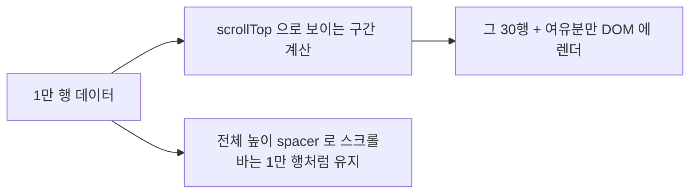

# **가상 스크롤 직접 구현하기**
회사 관리자 화면에 목록 테이블이 하나 있었는데, 데이터가 쌓이면서 행이 수만 개가 됐다. 그랬더니 페이지가 열릴 때 몇 초씩 멈추고, 스크롤은 뚝뚝 끊겼다. 원인은 단순했다. 화면엔 기껏해야 20~30행이 보이는데, DOM에는 수만 개의 행이 전부 그려져 있었던 거다.

브라우저 입장에선 보이든 안 보이든 그 수만 개를 다 만들어서 메모리에 들고 있어야 하고, 레이아웃도 계산해야 한다. 안 보이는 9천 몇백 행까지 다 그리느라 죽어나는 거다. 이걸 푸는 방법이 가상 스크롤(virtual scroll), 다른 말로 windowing이다. 라이브러리를 쓰면 금방인데, 원리를 알고 싶어서 직접 만들어봤다. 생각보다 핵심은 단순하다.

## **핵심 아이디어 - 보이는 것만 그린다**
가상 스크롤의 발상은 한 줄로 요약된다. **화면에 보이는 행만 실제로 그리고, 안 보이는 행은 자리(높이)만 차지하게 한다.** 1만 행이 있어도 화면에 30행만 보인다면, DOM에는 그 30행(과 약간의 여유분)만 둔다. 스크롤을 내리면 그 30행의 내용을 바꿔치기한다. 사용자는 1만 행을 스크롤하는 것처럼 느끼지만, 실제 DOM 노드는 항상 30개 남짓이다.

이게 되려면 두 가지를 속여야 한다. 하나는 스크롤바다. DOM에 30행만 있으면 스크롤바도 30행짜리로 짧아진다. 그래서 "전체가 1만 행만큼 길다" 는 빈 공간(spacer)을 만들어 스크롤바를 진짜처럼 보이게 한다. 다른 하나는 위치다. 보이는 30행을 스크롤 위치에 맞는 자리에 정확히 갖다놔야 한다.

## **기본 구현 - 고정 높이부터**
제일 단순한 경우, 모든 행의 높이가 똑같다고 치자(예: 40px). 그럼 계산이 산수다.

- 전체 높이 = 행 개수 × 행 높이
- 지금 보이는 첫 행 번호 = `scrollTop / 행 높이`
- 화면에 보이는 행 수 = `뷰포트 높이 / 행 높이`

이걸 React로 옮기면 이 정도다.

~~~jsx
function VirtualList({ items, rowHeight, height }) {
  const [scrollTop, setScrollTop] = useState(0);

  const totalHeight = items.length * rowHeight;            // 전체 가상 높이
  const startIndex = Math.floor(scrollTop / rowHeight);    // 보이는 첫 행
  const visibleCount = Math.ceil(height / rowHeight);      // 화면에 들어가는 행 수
  const endIndex = startIndex + visibleCount;

  const visible = items.slice(startIndex, endIndex);       // 이 구간만 렌더

  return (
    
 setScrollTop(e.currentTarget.scrollTop)}
    >
      {/* 전체 높이만큼 자리를 차지하는 spacer — 스크롤바를 진짜처럼 */}
      

        {visible.map((item, i) => {
          const index = startIndex + i;
          return (
            

              {item.label}
            

          );
        })}
      

    

  );
}
~~~

이게 전부다. `onScroll` 에서 `scrollTop` 을 받아 보이는 구간을 다시 계산하고, 그 구간만 잘라서(`slice`) 그린다. 각 행은 `position: absolute` 에 `top` 으로 원래 자리에 박는다. 바깥 div가 전체 높이만큼 자리를 차지하니 스크롤바는 1만 행짜리로 길고, 실제 그려지는 건 화면에 들어가는 몇십 개뿐이다. 1만 행이든 100만 행이든 DOM 노드 수는 일정하다.

한가지 작은 최적화를 덧붙이면, 행 위치를 `top` 대신 `transform: translateY(...)` 로 잡는 게 더 부드럽다. `top` 을 바꾸면 브라우저가 레이아웃을 다시 계산하는데, `transform` 은 레이아웃 단계를 건너뛰고 합성(compositing)만 해서 비용이 싸다. 스크롤처럼 매 프레임 위치가 바뀌는 상황에선 이 차이가 체감된다. 그리고 각 행 컴포넌트를 `memo` 로 감싸두면, 스크롤로 구간이 바뀌어도 내용이 같은 행은 다시 안 그려서 리렌더를 아낀다. 가상 스크롤은 그릴 행을 줄이는 게 1차고, 그 줄인 행도 가볍게 그리는 게 2차다.

## **함정 1 - 빠르게 스크롤하면 빈 화면이 번쩍인다**
위 코드를 그대로 쓰면 천천히 스크롤할 땐 괜찮은데, 빠르게 휙 내리면 잠깐씩 빈 공간이 번쩍인다. 스크롤이 렌더보다 빨라서, 새 행이 그려지기 전에 화면이 먼저 그 자리로 가버리기 때문이다.

그래서 보이는 구간보다 위아래로 몇 행씩 더 그려둔다. 이걸 overscan이라고 부른다. 미리 그려둔 여유분이 있으니, 스크롤이 좀 빨라도 이미 DOM에 있는 행이 슬쩍 들어온다. 보통 5~10행이면 충분하다.

~~~jsx
const OVERSCAN = 5;
const startIndex = Math.max(0, Math.floor(scrollTop / rowHeight) - OVERSCAN);
const endIndex = Math.min(
  items.length,
  Math.floor(scrollTop / rowHeight) + visibleCount + OVERSCAN
);
~~~

overscan을 너무 키우면 그만큼 더 그리니 의미가 없어진다. 빈 화면이 보이면 조금씩 늘리면서 맞추는 게 좋다. 번쩍임이 overscan만으로 안 잡히면, 행 자체가 너무 무거운(이미지를 동기로 불러온다든가) 경우가 많다. 그땐 행을 가볍게 만들거나 이미지에 placeholder를 두는 게 먼저다.

## **함정 2 - 행 높이가 제각각이면 갑자기 어려워진다**
지금까진 모든 행 높이가 같다고 가정했다. 이게 가상 스크롤을 쉽게 만들어준 핵심이었다. `top = index × rowHeight` 라는 산수가 성립했으니까. 근데 현실에선 행 높이가 다른 경우가 많다. 댓글 길이가 다르거나, 어떤 행은 한 줄이고 어떤 행은 다섯 줄이거나.

높이가 제각각이면 계산이 단번에 복잡해진다. 우선 "n번째 행이 어디서 시작하는가" 를 곱셈으로 못 구한다. 대신 각 행 높이의 누적합(prefix sum) 배열을 들고 있어야 한다. `prefix[i]` 를 0번부터 i-1번까지 높이의 합으로 정의하면, i번째 행의 시작 위치가 곧 `prefix[i]` 다. 전체 높이는 마지막 누적합이고.

더 까다로운 건 반대 방향이다. 스크롤 위치(`scrollTop`)가 주어졌을 때 "지금 화면 맨 위에 걸린 행이 몇 번이냐" 를 구해야 한다. 고정 높이면 `scrollTop / rowHeight` 나눗셈 한 번(O(1))인데, 가변 높이는 누적합 배열에서 `scrollTop` 이 끼는 구간을 찾아야 한다. 다행히 누적합은 항상 증가하니(단조 증가) 이진탐색이 딱 맞는다. `scrollTop` 이하인 가장 큰 누적합의 위치가 시작 행이다.

~~~javascript
// prefix[i] = 0..i-1 행 높이의 누적합 (단조 증가)
function findStartIndex(prefix, scrollTop) {
  let lo = 0, hi = prefix.length - 1;
  while (lo < hi) {
    const mid = (lo + hi + 1) >> 1;
    if (prefix[mid] <= scrollTop) lo = mid;   // 아직 위 — 더 내려가도 됨
    else hi = mid - 1;
  }
  return lo;
}
~~~

이러면 행이 10만 개여도 17번 비교(log₂ 100000 ≈ 17)면 시작 행을 찾는다. 고정 높이의 단순 산수가 가변 높이에선 "누적합 + 이진탐색" 으로 바뀌는 셈이고, 사실상 이게 가변 가상 스크롤의 계산 코어다.

진짜 골치아픈 건 따로 있다. 위 누적합을 만들려면 모든 행의 높이를 알아야 하는데, 높이를 알려면 그려봐야 하고, 안 그리려고 가상 스크롤을 하는 거라 모순이다. 그래서 추정(estimate)과 실측을 섞는다. 처음엔 "대충 이 정도" 하고 추정 높이로 누적합을 채워 그린 뒤, 실제 그려진 행을 측정해서(`getBoundingClientRect().height` — `offsetHeight` 는 브라우저 배율이나 transform에서 부정확하다) 누적합을 진짜값으로 보정한다. 추정과 실측이 어긋나니, 스크롤을 내리며 높이가 하나씩 고쳐질 때마다 전체 높이가 바뀌고 스크롤바 두께가 미세하게 출렁이거나 위로 빠르게 올라갈 때 위치가 튄다. 추정 방식의 숙명이라 완전히는 못 없앤다.

그런데 이 "그려봐야 높이를 안다" 는 모순 자체를 다르게 푸는 도구도 최근에 나왔다. pretext.js 라는 라이브러리인데, 텍스트 높이를 DOM에 그리지 않고 오프스크린 canvas로 글자를 재서 순수 계산으로 미리 구한다. `getBoundingClientRect` 같은 DOM 측정은 레이아웃 reflow를 일으켜 비싼데, 그 단계를 통째로 건너뛴다(한국어처럼 복잡한 문자 체계도 처리한다). 가변 높이 가상 스크롤에서 제일 골치아픈 추정-실측 출렁임을, 애초에 정확한 높이를 미리 아는 걸로 줄인다는 점에서 결이 맞다. 어쨌든 가변 높이부터는 이런 게 줄줄이 붙어서, 직접 다 짜기보다 검증된 라이브러리를 쓰는 게 합리적인 지점이 온다.

## **그럼 페이지네이션이나 무한 스크롤은?**
큰 목록을 다루는 방법이 가상 스크롤만 있는 건 아니다. 셋을 비교하면 이렇다.

- **페이지네이션**: 한 번에 한 페이지(수십 행)만 보여준다. DOM이 항상 적어서 단순하고, "3페이지로 가기" 같은 위치 감각이 좋다. 정형 데이터, 업무용 표에 잘 맞는다.
- **무한 스크롤**: 내리면 다음 묶음을 이어붙인다. 탐색/둘러보기 성격엔 좋은데, 계속 append하면 DOM이 무한정 쌓여서 결국 느려진다(가상 스크롤과 합쳐 쓰기도 한다).
- **가상 스크롤**: 전체를 스크롤하는 느낌은 그대로면서 DOM은 일정하게 유지한다. 수만 행을 한 화면에서 위아래로 훑어야 할 때 빛난다.

정리하면, 업무용 표는 페이지네이션 + 서버 필터가 보통 무난하고, 정말 수만 행을 끊김 없이 스크롤해야 하는 화면일 때 가상 스크롤을 꺼낸다. 우리 경우가 후자였다. 그리고 데이터가 진짜 많으면(수만 건 이상) 그걸 한 번에 다 내려받는 것 자체가 부담이라, 서버에서 잘라 받는 것과 가상 스크롤을 같이 쓴다.

## **정리**
- 가상 스크롤은 "보이는 행만 그리고, 나머지는 높이(spacer)만 차지" 시키는 기법이다. DOM 노드 수가 데이터 양과 무관하게 일정해진다.
- 고정 높이면 산수로 끝난다. `scrollTop` 으로 보이는 구간을 계산해 그 구간만 `absolute` 로 제자리에 그린다.
- 빠른 스크롤의 빈 화면은 overscan(위아래 여유분 몇 행)으로 막는다.
- 행 높이가 가변이면 추정+실측으로 풀어야 하는데, 누적 오차로 스크롤바가 출렁이는 등 난이도가 급격히 오른다. 여기부턴 라이브러리가 합리적이다.
- 큰 목록이 다 가상 스크롤은 아니다. 업무용 표는 페이지네이션, 탐색형은 무한 스크롤이 맞을 때도 많다.

고정 높이 가상 스크롤은 백 줄도 안 된다. 근데 가변 높이에 누적합, 이진탐색, 추정-실측 보정까지 붙으면 코드가 확 불어난다. 그제서야 이게 왜 라이브러리로 존재하는지 알겠더라. 그래서 결론은 좀 김빠지는데 — 고정 높이면 직접 짜고, 가변 높이부터는 라이브러리를 쓴다. 대신 바닥부터 한번 만들어본 덕에, 라이브러리 옵션에서 estimateSize니 overscan이니 하는 게 뭘 말하는지는 바로 알아봤다.
