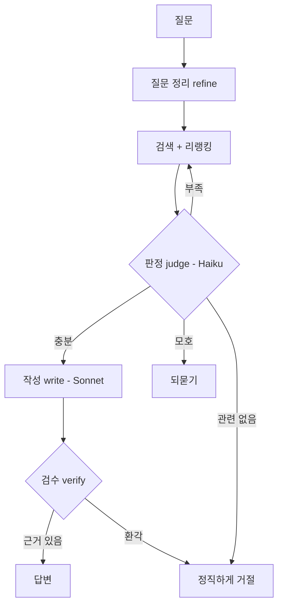
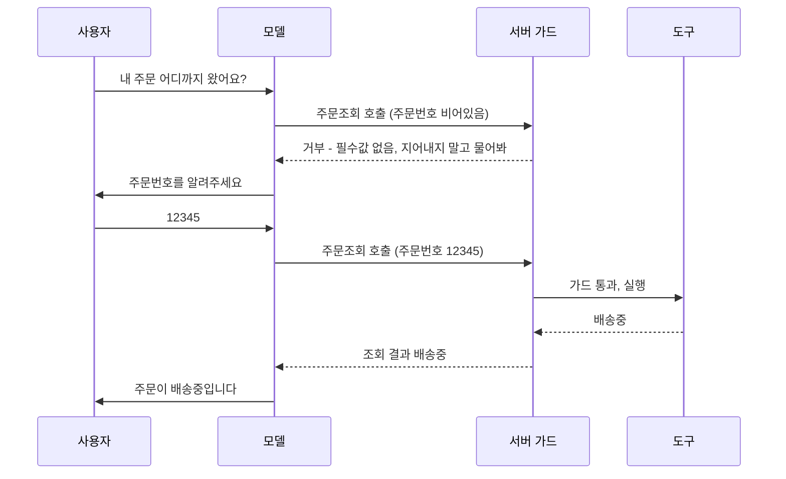

# **멀티에이전트 RAG 직접 만들기**
[지난 글]()에서 검색을 다듬고, 마지막에 LLM이 "이 자료로 답할 수 있나" 를 판단하게 했다. 사실 그 판단으로 재검색·되묻기·거절을 가르는 순간, 이미 단순 RAG를 넘어 에이전트의 영역에 발을 들인 거였다. 이번 글은 그걸 제대로 밀고 나간 이야기다. 역할을 나눈 여러 LLM이 협업하고, 자료로 안 되는 건 도구(tool calling)를 불러서 답하는 구조다.

흔히 이런 건 LangChain이나 LangGraph 같은 프레임워크로 짠다. 근데 우리는 안 썼다. 이유는 뒤에서 얘기하고, 일단 뭘 만들었는지부터 보자.

## **왜 한 모델한테 다 안 시키나**
제일 단순하게 가면, 검색한 자료랑 질문을 LLM 하나한테 통째로 주고 "알아서 판단하고 답해" 라고 할 수 있다. 근데 이게 잘 안 된다. 한 번의 호출에 "이 자료가 관련 있는지 판단", "관련 없으면 다시 검색할지 결정", "답을 작성", "그 답이 근거가 있는지 검증" 을 다 욱여넣으면, 모델이 산만해지고 어느 하나도 똑부러지게 못 한다.

그래서 일을 쪼개서 역할이 다른 단계로 나눴다. 각 단계는 자기 일만 한다.

- **판정(judge)**: 검색 결과가 이 질문의 답이 되는지 본다. 답이 나온다.
- **작성(write)**: 판정이 통과시킨 자료로 실제 답을 쓴다.
- **검수(verify)**: 작성된 답이 자료에 진짜 근거하는지 따로 검증한다.

쪼개니까 좋은 점이 또 하나 있었다. 단계마다 다른 모델을 쓸 수 있다. 판정은 빠르고 자주 부르니까 작고 싼 모델(우리는 Haiku)을 쓰고, 답 작성은 품질이 중요하니까 크고 똑똑한 모델(Sonnet)을 쓴다. 모든 걸 비싼 모델로 돌리지 않아도 되니 비용이 확 줄었다. 역할을 나누는 게 단지 깔끔함의 문제가 아니라 비용·품질을 같이 잡는 수단이었다.

## **판정 - 점수가 아니라 의미로 가른다 (CRAG)**
판정 단계는 검색 결과 후보들을 판정 모델에게 주고, 이 질문에 답이 되는지를 묻는다. 핵심은 유사도 점수로 자르지 않고 의미로 판단하게 한다는 점이다. 이런 식으로 검색 결과를 평가해 교정하는 방식을 CRAG(Corrective RAG)라고 부른다.

판정 결과는 단순히 "예/아니오" 가 아니라 네 갈래로 나오게 했다.

- **충분**: 이 자료로 답할 수 있다 → 작성으로.
- **부족**: 방향은 맞는데 자료가 모자라다 → 검색어를 바꿔 한 번 더(corrective).
- **모호**: 질문이 애매하다 → 사용자에게 되묻기.
- **관련 없음**: 우리 지식에 없다 → 모른다고 정직하게.

여기서 한 가지 안전장치를 뒀다. 판정 모델 호출이 실패하거나 형식이 깨지면, 후보 상위 몇 개를 그냥 "충분" 으로 살린다(fail-soft). 판정이 삐끗했다고 멀쩡한 질문을 거절해버리는 게, 어설픈 답보다 더 나쁜 경험일 때가 많아서다. 어차피 뒤에 검수가 한 번 더 거른다.

## **검수 - 작성자 자신에게 안 맡긴다**
작성 단계가 답을 쓰고 나면, 그걸 그대로 내보내지 않는다. 별도의 검수 단계가 "이 답의 핵심 주장이 자료에 실제로 있나" 를 자료와 대조해서 확인한다. 없는 기능을 있다고 하거나 수치를 지어낸(환각) 답을 여기서 잡는다.

중요한 건 검수를 작성자 자신이 아니라 독립된 단계로 뒀다는 점이다. 같은 호출 안에서 "네가 쓴 답 맞는지 너가 검토해" 하면 자기 답을 잘 못 의심한다. 이게 단순히 "민망해서" 가 아니라 LLM의 구조적 약점이다. 모델은 자기가 지어낸 출력을 비판 없이 받아들이는 경향(self-sycophancy)이 있고, 특히 사람 피드백으로 다듬어진 모델일수록 틀려도 "맞다고 해주는" 쪽으로 기운다. 그래서 같은 모델한테 "네 답 맞아?" 물으면 십중팔구 "맞다" 고 한다. 자기 답을 채점할 땐 더 후해지는 셈이다. 그래서 작성과 검수를 분리하고, 검수는 "원본 자료" 와 "작성된 답" 만 받아 대조한다. 답을 쓴 맥락을 모르는 채 자료와 답만 비교하니, 자기편을 들 여지가 없다. 검수가 근거 없다고 판정하면, 문제된 주장만 빼고 한 번 더 작성을 시도하고, 그래도 안 되면 거절한다. 어설픈 답을 내느니 모른다고 하는 게 챗봇 신뢰엔 낫다.

## **자료로 안 되는 질문 - 도구 호출(tool calling)**
여기까진 "우리가 가진 문서로 답하는" 그림이다. 근데 챗봇엔 문서로 못 푸는 질문이 온다. "내 주문 어디까지 왔어요" 같은 거다. 이건 어느 문서에도 안 적혀 있고, 그 사람의 주문을 실시간으로 조회해야 답이 나온다. 이때 필요한 게 도구 호출이다.

도구 호출의 작동 방식부터 정확히 짚자. **LLM은 도구를 직접 실행하지 않는다.** 모델이 하는 건 "이 도구를, 이 인자로 불러줘" 라는 요청을 구조화된 JSON으로 내놓는 것뿐이다. 실제 실행(주문 조회 API 호출 등)은 우리 서버 코드가 한다. 그 결과를 다시 모델에게 돌려주면, 모델이 그걸 보고 자연어로 답을 마무리한다. 모델이 도구를 또 부르겠다고 하면 이 과정을 반복한다.

~~~java
for (int round = 0; round < MAX_ROUNDS; round++) {
    var resp = chatModel.call(messages, tools);      // 도구 목록을 같이 넘긴다

    if (resp.getToolCalls().isEmpty()) {
        return resp.getText();                        // 도구 안 부르고 답함 → 끝
    }
    // 모델이 부른 도구들을 "서버가" 실행하고 결과를 대화에 붙인다
    for (var call : resp.getToolCalls()) {
        var result = executeWithGuards(call);         // 가드는 아래에서
        messages.add(toolResult(call.id(), result));
    }
    // 다음 라운드에서 모델이 그 결과를 보고 답하거나, 또 도구를 부른다
}
~~~

이 "생각하고 → 도구 부르고 → 결과 보고 → 다시 생각" 하는 순환에는 ReAct(Reasoning + Acting)라는 이름이 붙어 있다. 모델이 어떻게 할지 추론하고(Thought), 도구를 부르고(Action), 그 결과를 받는(Observation) 걸 반복하는 패턴이다. 핵심은 중간의 결과(Observation)가 모델이 지어낸 게 아니라 외부 시스템에서 온 진짜 값이라는 점이다. 모델이 혼자 추론만 길게 하면 환각으로 흘러가기 쉬운데, 매 라운드 실제 조회 결과가 끼어들어 모델을 현실에 붙들어맨다. 다만 이 루프는 가만 두면 모델이 도구를 계속 부르며 맴돌 수 있어서, 라운드 수에 상한(우리는 4)을 두고 마지막 라운드엔 도구를 아예 빼버린다. 그럼 모델은 가진 정보로 답을 마무리할 수밖에 없다.

대부분의 라이브러리에는 이 루프를 자동으로 돌려주는 기능이 있다. 모델이 도구를 부르면 알아서 실행하고 결과를 넣어 재호출하는 식이다. 근데 우리는 그 자동 실행을 꺼두고 루프를 직접 돌렸다. 이유는 하나다. 도구를 실행하기 전에 끼워넣어야 할 가드가 많았기 때문이다.

## **서버가 모델을 안 믿는다 - 가드**
도구 호출에서 제일 중요한 건, **모델이 시킨다고 그대로 실행하면 안 된다**는 거다. 모델은 가끔 인자를 지어내고, 하면 안 되는 작업을 하려 든다. 그래서 실행 직전에 서버가 가드를 강제한다.

첫째, **파라미터 환각 차단**이다. 주문 조회에 주문번호가 필요한데 사용자가 안 알려줬으면, 모델이 그럴듯한 번호를 지어내서 호출하려 할 때가 있다. 그래서 필수 파라미터가 비었으면 실행을 막고, "값을 지어내지 말고 사용자에게 물어봐" 라는 메시지를 모델에게 돌려준다. 그럼 모델이 주문번호를 되묻는다.

~~~java
String executeWithGuards(ToolCall call) {
    var action = registry.resolve(call.name());
    if (action == null) return error("알 수 없는 도구입니다");

    // 필수 파라미터 환각 차단 — 모델이 값을 지어내 호출하는 것 방지
    for (var p : action.requiredParams()) {
        if (isBlank(call.args().get(p))) {
            return error("필수 정보(" + p + ")가 없습니다. 지어내지 말고 사용자에게 물어보세요");
        }
    }
    // 변경성 작업은 사람 승인 없이 실행 금지 (아래)
    if (action.isMutating() && !confirmed) {
        return pauseForConfirm(call);
    }
    return actionExecutor.execute(action, call.args());
}
~~~

한 사이클을 그림으로 보면 이렇다. 모델의 도구 호출이 곧장 실행되는 게 아니라, 가드를 거쳐 되묻기로 빠졌다가 값을 채운 뒤에야 실행된다.

ReAct 루프(모델의 추론·행동)와 서버 가드(실행 통제)가 맞물리는 지점이 보인다. 모델은 도구를 부르겠다고 "제안" 할 뿐이고, 부를지 말지·되물을지는 서버가 정한다.

둘째, **변경성 작업은 사람이 승인해야 한다**. 조회(읽기)는 잘못돼도 다시 조회하면 그만이지만, 주문 취소나 정보 변경 같은 건 한번 실행되면 되돌리기 어렵다. 그래서 변경성 도구는 모델이 부르더라도 자동으로 실행하지 않고, 사용자에게 "이 작업을 진행할까요?" 확인 버튼을 띄운다. 사람이 버튼을 눌러야 비로소 실행된다. 흔히 human-in-the-loop이라고 부르는 패턴이다.

여기서 주의할 게 있다. 확인 버튼을 아무 작업에나 띄우면 안 된다. 매번 "진행할까요?" 가 뜨면 사용자는 내용을 안 읽고 습관적으로 눌러버린다. 이걸 confirmation fatigue라고 하는데, 이러면 확인 버튼이 안전장치 역할을 못 한다. 그래서 되돌릴 수 있는 조회는 자동으로 실행하고, 확인은 진짜 되돌리기 어려운 변경성 작업에만 띄워서 횟수를 최소화했다. 안전장치는 자주 울릴수록 무뎌진다.

## **승인과 실행 사이를 잠근다**
이 확인 버튼에서 미묘하지만 중요한 함정이 하나 있다. 사용자가 "진행할게요" 를 누른 다음, 실제로 실행할 때 그 작업의 인자가 바뀌어 있으면 안 된다는 거다.

순진하게 짜면 이렇게 된다. 확인 버튼을 누르면 다시 모델을 호출해서 "사용자가 승인했으니 진행해" 한다. 근데 이때 모델이 LLM이라 약간 다른 인자로 도구를 부를 수 있다. 사용자는 "A를 취소" 를 승인했는데 실제로는 "B를 취소" 가 실행되는 사고가 가능한 거다. 화면에 보여준 것과 실행된 게 달라지는 것이다.

그래서 우리는 확인 버튼을 띄우는 순간, **실행할 도구 호출과 그 인자를 그대로 보관**한다. 사용자가 승인하면 모델을 다시 부르지 않고, 보관해둔 그 인자 그대로 실행한다. 모델이 중간에 다시 개입할 여지를 없앤 거다. 보여준 게 곧 실행되는 것을 구조적으로 보장한다. 로그인이 필요한 조회도 같은 식이다 — 도구 호출을 보관해두고, 로그인하면 보관된 그대로 이어서 실행한다.

여기에 더해 변경성 작업 전에 본인확인(인증번호)을 한 단계 더 두기도 했는데, 이것도 같은 원리다. 인증이 통과되기 전까지 실행을 잠가두고, 통과하면 보관된 호출을 실행한다.

## **그래서 왜 프레임워크를 안 썼나**
이쯤 보면 LangChain 같은 프레임워크를 썼으면 이 루프나 도구 호출을 공짜로 얻었을 거란 생각이 든다. 실제로 그렇다. 근데 우리가 직접 짠 데는 이유가 있었다.

이 시스템의 까다로운 부분은 도구를 "어떻게 부르냐" 가 아니라 도구를 "언제, 어떤 조건에서 실행하냐" 였다. 변경성이면 확인 버튼, 로그인이 필요하면 중단-재개, 인자가 비면 되묻기, 승인과 실행 사이는 잠그기. 이 가드들이 우리 도메인에 딱 맞물려 있어서, 프레임워크의 자동 도구 실행 위에 이걸 다 끼워넣으려면 오히려 프레임워크와 싸우게 됐다. 도구 호출 자체는 라이브러리(우리는 Spring AI)의 얇은 기능으로 충분했고, 그 위의 오케스트레이션과 가드는 우리가 들고 있는 게 통제하기 편했다.

프레임워크가 나쁘다는 게 아니다. 빠르게 만들 땐 그게 맞다. 다만 핵심 로직이 "모델을 어떻게 통제하느냐" 에 있는 시스템이라면, 그 통제권을 프레임워크에 넘기지 않는 선택도 충분히 합리적이라는 거다. 우리는 후자였다.

## **결국 하나의 원리였다 - 모델은 제안하고, 코드가 처분한다**
지금까지 판정, 검수, 도구 가드를 따로따로 설명했는데, 다시 보면 전부 같은 원리다. 모델이 내놓는 모든 출력 — 어느 자료가 관련 있다는 판정도, 작성한 답도, 어떤 도구를 어떤 인자로 부르겠다는 요청도 — 을 우리는 "제안" 으로만 받는다. 그 제안을 실제로 채택하거나 실행하는 결정은, 검증을 통과한 다음에 결정론적인 코드가 내린다.

판정이 "충분" 이라 해도 검수가 근거를 못 찾으면 답은 안 나간다. 모델이 도구를 부르겠다 해도 가드를 통과해야 실행되고, 변경성 작업은 사람이 버튼을 눌러야 한다. 모델은 흐름의 어디에서도 최종 결정권을 쥐지 않는다. 똑똑하지만 가끔 틀리는 존재한테는 "제안" 까지만 맡기고, 돌이킬 수 없는 "결정" 은 틀리지 않는 코드가 쥐는 것이다. 이게 신뢰의 경계를 긋는 일이다 — 모델의 출력을 어디까지 믿고, 어디서부터 검증할지.

말장난처럼 들리지만 실무에선 이 한 줄이 설계를 갈랐다. "모델이 똑똑하니 알아서 하겠지" 로 가면 가드가 뚫리고, "모델은 제안만, 결정은 코드가" 로 가면 모델이 틀려도 사고로 안 번진다. 멀티에이전트가 안정적으로 돌아가는 건 각 모델이 영리해서가 아니라, 이 경계가 곳곳에 그어져 있어서다.

## **정리**
- 한 모델한테 판단·작성·검수를 다 시키면 산만해진다. 역할을 나누고, 단계마다 맞는 모델(판정은 싼 모델, 작성은 똑똑한 모델)을 써서 비용과 품질을 같이 잡는다.
- 판정(CRAG)은 점수가 아니라 의미로 충분/부족/모호/없음을 가른다. 부족하면 검색을 교정한다.
- 검수는 작성자와 분리해서, 답이 자료에 근거하는지 독립적으로 대조한다. 환각을 여기서 막는다.
- 문서로 못 푸는 질문은 도구 호출로 푼다. LLM은 호출 명세만 내고, 실행은 서버가 한다.
- 서버가 모델을 믿지 않고 가드를 강제한다 — 파라미터 환각 차단, 변경성은 사람 승인, 승인과 실행 사이는 인자를 잠가 변조를 막는다.

RAG에서 출발해 검색을 다듬고, 판단과 도구를 붙이다 보니 어느새 작은 에이전트 시스템이 됐다. 모델은 앞으로도 점점 똑똑해지겠지만, 그 똑똑함을 어디까지 믿고 어디서부터 의심할지 선을 긋는 일은 한동안 사람 몫으로 남을 것 같다.
