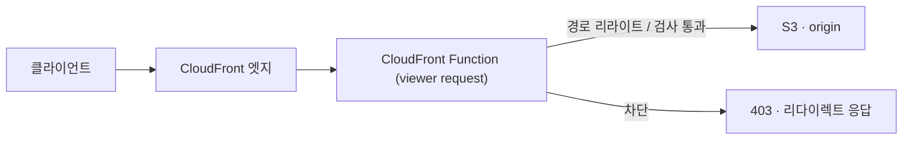

# **CloudFront Function 으로 엣지에서 처리하기**
[메일 시스템 글]()에서 CloudFront로 프론트(React SPA)를 S3에 서빙한다고 했다. 근데 SPA를 S3 + CloudFront로 올리면 흔히 밟는 함정이 하나 있다. 사용자가 `/posts/abc` 같은 경로에서 새로고침을 하면 404가 뜬다.

이유는 단순하다. SPA는 라우팅을 브라우저(자바스크립트)가 한다. 실제로 S3에 있는 파일은 `index.html` 하나뿐이고, `/posts/abc` 라는 파일은 없다. 처음 접속해서 JS가 로드된 뒤에는 클라이언트 라우터가 화면을 바꿔주지만, 그 경로에서 새로고침하면 브라우저가 S3한테 `/posts/abc` 파일을 직접 달라고 하고, S3엔 그게 없으니 404다.

이걸 푸는 방법이 두 가지다. 하나는 함수 없이 CloudFront 설정만으로, 다른 하나는 CloudFront Function으로. 흔히 쓰는 첫 번째 방법부터 보고, 그 한계 때문에 두 번째로 넘어간 과정을 따라가보자.

## **방법 1 - 함수 없이, Custom Error Response**
사실 함수를 안 쓰고도 이 404를 풀 수 있다. 그리고 이게 더 오래됐고 더 흔한 방법이다. CloudFront에는 origin이 특정 에러를 돌려줬을 때 다른 페이지로 바꿔 응답하는 Custom Error Response 기능이 있다. SPA라면 보통 이렇게 건다.

- S3가 없는 경로에 403(또는 404)을 반환하면
- CloudFront가 그걸 가로채서 `/index.html` 을 `200` 으로 돌려준다

S3는 객체가 없을 때 권한 설정에 따라 403이나 404를 주는데, OAC로 막아둔 비공개 버킷이면 보통 403이다. 그래서 보통 `403 → 200, /index.html` 로 매핑한다. 설정 한 번이면 끝이고 코드도, 추가 비용도 없다. 실제로 우리 회사의 다른 서비스들도 대부분 이 방식으로 SPA를 띄우고 있다.

근데 이 방식엔 거슬리는 한계가 몇 개 있다.

## **그 한계**
첫째, **모든 403/404를 index.html로 덮어버린다.** 이게 distribution 전체에 걸린다. 그래서 같은 distribution에 API가 물려 있으면, API가 권한 없음으로 403을 돌려줘도 사용자는 200 + index.html을 받는다. 프론트가 진짜 에러를 에러로 처리할 수가 없어지는 거다. 우리는 CloudFront 하나에 프론트와 API를 같이 물려놨으니([메일 시스템 글]()의 그 구성), 이 부작용이 특히 신경쓰였다.

둘째, **진짜 없는 페이지도 200이 된다.** 정말로 존재하지 않는 경로도 index.html이 200으로 나간다. 검색 엔진 입장에선 "없는 페이지인데 정상" 으로 인식하니 SEO에 안 좋고, 404여야 할 게 200인 것 자체가 의미상 찜찜하다.

셋째, **매번 origin을 한 번 갔다 온다.** 이 방식은 "S3가 403을 줘야" CloudFront가 그걸 index.html로 바꾼다. 없는 경로마다 일단 S3까지 요청이 갔다가 403을 받고 그제서야 변환되는, 사후 처리라 한 번의 왕복이 낀다.

이 셋이 견딜 만하면 Custom Error Response로 충분하다. 근데 우리는 첫째 — API 에러 마스킹 — 가 걸려서 다른 방법을 봤다. 그게 CloudFront Function이다.

## **방법 2 - CloudFront Function 이 뭐냐**
CloudFront Function은 CloudFront 엣지에서 실행되는 아주 가벼운 JavaScript다. 사용자의 요청이 들어오거나(viewer request) 응답이 나갈 때(viewer response) 그 사이에 끼어들어서 요청·응답을 주무를 수 있다. 특징은 "극단적으로 가볍다" 는 거다. 실행 시간이 1밀리초 미만이고, 초당 수백만 요청도 그냥 받아낸다. 그 대신 할 수 있는 게 제한적이다. 네트워크 호출도 못 하고, 파일도 못 읽고, 외부 API나 DB도 못 부른다. 순수하게 들어온 요청을 보고 헤더나 경로를 바꾸는 정도다.

엣지에서 도니까 사용자랑 제일 가까운 데서 즉시 처리된다. origin(S3나 우리 서버)까지 안 가고 엣지에서 끝내버리는 일들에 적합하다.

## **실전 1 - SPA 경로를 index.html 로 리라이트**
처음 말한 404 문제를 푸는 함수다. 들어온 경로에 파일 확장자가 없으면(즉 `/posts/abc` 처럼 실제 파일이 아니라 SPA 라우트면) 경로를 `/index.html` 로 바꾼다.

~~~javascript
function handler(event) {
    var request = event.request;
    var uri = request.uri;

    // 확장자가 없는 경로 = SPA 라우트 → index.html 로 넘긴다
    // (/posts/abc 는 S3에 없지만 /index.html 은 있다)
    if (uri.indexOf('.') === -1) {
        request.uri = '/index.html';
    }

    return request;
}
~~~

이러면 S3는 항상 `index.html` 을 돌려주고, 브라우저에서 JS가 로드된 뒤 클라이언트 라우터가 `/posts/abc` 화면을 그린다. 새로고침해도 404가 안 뜬다. 코드가 이게 전부다. 이런 자잘하지만 모든 요청에 걸리는 처리가 CloudFront Function의 전형적인 용도다.

여기서 `indexOf('.') === -1` 로 확장자를 본 이유가 있다. CloudFront Function의 런타임은 모던 JavaScript를 다 지원하지 않는다. 그래서 `String.includes` 같은 비교적 최근 문법보다 `indexOf` 처럼 옛날 방식이 안전하다. 이건 아래 "제약" 에서 다시 본다.

## **두 방식을 나란히 놓으면**
같은 SPA 404를 푸는데 둘은 접근이 정반대다.

- **Custom Error Response는 응답 단계의 사후 처리다.** 요청이 S3까지 가서 403을 받은 뒤, CloudFront가 그 에러 응답을 index.html로 바꾼다. 설정만으로 되고 공짜지만, 모든 에러를 싸잡아 덮는다.
- **CloudFront Function은 요청 단계의 사전 처리다.** 요청이 S3에 닿기 전에 경로를 index.html로 바꿔버린다. SPA 라우트만 골라서 처리할 수 있고(API나 진짜 에러는 안 건드림), 없는 경로로 origin까지 헛걸음하지도 않는다. 대신 함수 호출 비용($0.10/100만)이 든다.

한 줄로 줄이면, 단순하고 공짜면 Custom Error Response, 정밀한 제어가 필요하면 CloudFront Function이다. 우리는 같은 CloudFront에 API가 물려 있어 "에러를 싸잡아 덮으면 안 되는" 상황이었고, 그래서 Function으로 갔다. 비용은 트래픽을 봐도 미미했고, 오히려 헛걸음(origin 왕복)이 줄어 손해도 아니었다.

## **실전 2 - 특정 IP만 들여보내기**
관리자 화면처럼 사내에서만 접근해야 하는 경로가 있다. 이런 건 회사 IP에서 온 요청만 통과시키고 싶다. CloudFront Function은 viewer request 시점에 접속 IP를 볼 수 있으니, 허용 목록에 없으면 그 자리에서 403을 돌려보낸다. origin까지 갈 것도 없다.

~~~javascript
var ALLOWED = ['203.0.113.10', '203.0.113.11'];   // 사내 IP

function handler(event) {
    var ip = event.viewer.ip;

    if (ALLOWED.indexOf(ip) === -1) {
        return {
            statusCode: 403,
            statusDescription: 'Forbidden',
            headers: {
                'content-type': { value: 'text/plain; charset=utf-8' }
            },
            body: '접근이 제한된 페이지입니다.'
        };
    }

    return event.request;   // 통과 — 원래 요청 그대로 흘려보낸다
}
~~~

함수가 `request` 를 반환하면 요청이 origin으로 계속 가고, 위처럼 응답 객체(`statusCode` 등)를 반환하면 거기서 끝나고 그 응답이 바로 사용자에게 간다. 차단을 엣지에서 끝내니 빠르고, origin은 차단된 요청을 구경도 못 한다.

이 외에도 헤더를 주무르는 일(보안 헤더 추가, 클라이언트 IP를 헤더로 origin에 전달), 국가별 페이지로 리다이렉트, 토큰(JWT 등) 검증으로 접근 제어 같은 게 전형적인 용도다. 공통점은 "가볍고, 모든 요청에 걸리고, 외부에 안 물어봐도 되는" 처리라는 점이다.

## **그럼 Lambda@Edge 는 언제 쓰나**
엣지에서 코드를 돌리는 방법이 CloudFront Function만 있는 건 아니다. Lambda@Edge도 있다. 둘은 비슷해 보이지만 쓰는 자리가 다르다.

CloudFront Function은 위에서 본 것처럼 극도로 가볍고 제약이 많다. 1밀리초 안에 끝나야 하고, 네트워크를 못 쓴다. 반면 Lambda@Edge는 Node.js나 Python으로 돌고, 수 초까지 실행되며, 외부 API나 DynamoDB 같은 AWS 서비스를 호출할 수 있다. 대신 무겁고 비싸다.

그래서 기준은 명확하다. **외부에 뭔가 물어봐야 하면 Lambda@Edge, 안 그러면 CloudFront Function이다.** 토큰을 외부 인증 서버에 검증해야 하거나, 이미지를 변환하거나, DB를 조회해야 하면 Lambda@Edge다. 단순히 경로를 바꾸거나 헤더를 손대거나 IP를 거르는 정도면 CloudFront Function으로 충분하다.

비용 차이도 무시 못 한다. CloudFront Function은 100만 호출당 $0.10이고 실행 시간으로는 과금을 안 한다. Lambda@Edge는 호출 비용만 6배($0.60)에 실행 시간 요금이 따로 붙는다. 모든 요청에 걸리는 처리라면 이 차이가 트래픽이 클수록 크게 벌어진다. 그래서 AWS도 일단 CloudFront Function으로 시작하고, 네트워크나 긴 실행이 필요해질 때만 Lambda@Edge로 올라가라고 권한다.

## **제약을 알고 써야 한다**
CloudFront Function이 가볍고 싼 건 제약을 세게 걸어둔 대가다. 몇 가지는 짜기 전에 알아야 덜 헤맨다.

- **네트워크·파일·외부 호출 전부 안 된다.** 함수 안에서 다른 API를 부르거나 DB를 보는 건 불가능하다. 들어온 요청 정보만으로 판단해야 한다. (그게 필요하면 Lambda@Edge다)
- **모던 JavaScript가 다 되진 않는다.** 런타임이 ES5.1을 기반으로 ES6 이후 기능을 일부만 골라 지원한다(런타임 2.0이 1.0보다 더 많이 지원하니, 새로 만들면 2.0으로 잡는 게 낫다). arrow function이나 템플릿 리터럴 같은 건 되는데, `String.includes` 처럼 지원 목록에 확실히 안 들어 있는 것도 있다. 위에서 `indexOf` 를 쓴 게 그래서다. 익숙한 문법이 안 돌면 ES5 시절 방식으로 바꿔보면 된다.
- **viewer 이벤트만 건드린다.** CloudFront 요청 흐름엔 viewer request/response 말고 origin request/response 단계도 있는데, CloudFront Function은 viewer 쪽(사용자와 CloudFront 사이)만 다룬다. origin(CloudFront와 S3 사이) 단계까지 손대려면 Lambda@Edge다.
- **코드 크기와 실행 시간 한도가 빡빡하다.** 큰 로직을 넣을 데가 아니다. 무거워지는 순간 CloudFront Function을 쓸 자리가 아니라는 신호다.

처음엔 이 제약들이 답답한데, 거꾸로 생각하면 "이걸로 될 만큼 단순한 일" 에만 쓰라는 가이드이기도 하다. 함수가 복잡해지기 시작하면 대개 도구를 잘못 고른 거였다.

## **정리**
- SPA를 S3 + CloudFront로 서빙하면 경로 새로고침에 404가 난다. 푸는 방법은 둘 — Custom Error Response(403→200 index.html)는 설정만으로 공짜지만 모든 에러를 덮고, CloudFront Function은 요청 단계서 SPA 라우트만 리라이트해 정밀하다.
- CloudFront Function은 엣지에서 도는 초경량 JS다. 경로 리라이트, 헤더 조작, IP 제한, 토큰 검증 같은 가벼운 일에 쓴다.
- 외부 호출·긴 실행·origin 단계가 필요하면 Lambda@Edge로 간다. 안 그러면 CloudFront Function이 빠르고 6배 싸다.
- 네트워크 불가, 제한된 런타임, viewer 이벤트 한정 — 제약을 먼저 알고 쓴다.

별것 아닌 것 같은 경로 리라이트 하나가, 안 해두면 사용자가 새로고침할 때마다 404를 본다. 엣지에서 처리하는 일들은 대개 이렇게 작지만, 모든 요청에 걸리는 길목이라 효과는 크다. origin에 부담을 안 주고 사용자 코앞에서 끝내는 게, 두고 보니 여러모로 깔끔했다.
