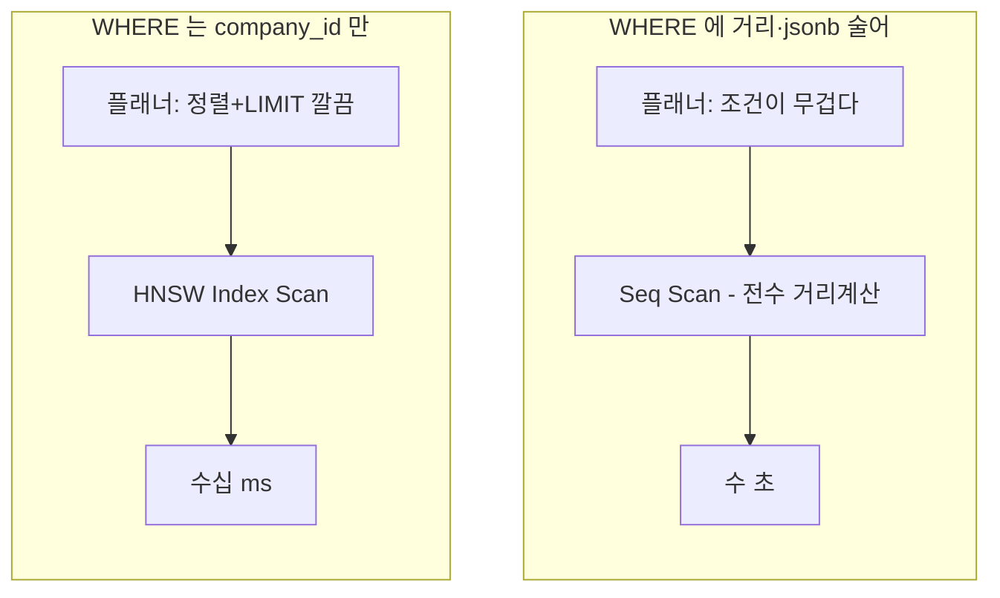

# **pgvector 벡터 검색이 HNSW 인덱스를 안 탈 때**
[예전에 pgvector로 RAG 챗봇의 벡터 검색을 만든 글]()을 썼었다. 그때는 HNSW 인덱스 걸고 잘 돌아갔는데, 데이터가 쌓이고 회사(테넌트)가 늘면서 어느 날부터 검색이 눈에 띄게 느려졌다. 원래 수십 밀리초면 끝나던 게 수 초씩 걸렸다.

원인을 찾는 데 시간이 좀 걸렸는데, 알고 보니 HNSW 인덱스를 아예 안 타고 있었다. 인덱스를 걸어뒀는데 안 쓰고 전수 스캔을 하고 있었던 거다. 이 글은 그걸 어떻게 진단하고 고쳤는지, 그리고 RDS라서 추가로 부딪힌 벽에 대한 기록이다.

## **일단 EXPLAIN 부터**
"느리다" 는 감이고, 확인은 `EXPLAIN` 이다. 벡터 검색 쿼리에 EXPLAIN을 붙여보니 이렇게 나왔다.

~~~
Limit
  ->  Sort  (Sort Key: (1 - (embedding <=> $1)))
        ->  Seq Scan on knowledge   ← 이게 문제
              Filter: ((company_id = $2) AND ((ai_snapshot->>'model') = $3) AND ...)
~~~

`Seq Scan`. HNSW 인덱스(`Index Scan using ...hnsw`)가 아니라 테이블을 통째로 훑고 있었다. 행마다 거리를 계산하고 정렬하니, 데이터가 늘수록 느려지는 게 당연했다. 인덱스는 멀쩡히 있는데 플래너가 안 쓰기로 결정한 것이다.

## **왜 인덱스를 안 탔나**
PostgreSQL 플래너는 인덱스를 쓸지 말지를 여러 조건으로 정한다. 벡터 검색에서 HNSW를 타려면 대략 이 형태여야 한다.

~~~sql
SELECT ... FROM knowledge
ORDER BY embedding <=> :query   -- 인덱스가 다루는 거리 연산자 + ORDER BY
LIMIT :k;
~~~

즉 "거리 연산자로 정렬해서 상위 K개" 라는 모양이 HNSW 인덱스가 최적화해주는 패턴이다. 근데 우리 쿼리엔 `WHERE` 에 이런 게 붙어 있었다.

~~~sql
WHERE company_id = :companyId
  AND ai_snapshot->>'model' = :model          -- jsonb 필터
  AND 1 - (embedding <=> :query) >= :threshold -- 거리 자체를 조건으로
ORDER BY embedding <=> :query
LIMIT :k;
~~~

두 개가 발목을 잡고 있었다. 하나는 **거리를 WHERE 조건으로 다시 쓴 것**(`1 - (embedding <=> query) >= threshold`)이다. 유사도가 일정 이상인 것만 받겠다고 넣은 건데, 이게 플래너 입장에선 "모든 행의 거리를 계산해서 걸러야 하는" 조건이라, 거리순 정렬을 인덱스로 최적화하는 대신 전수 계산 쪽으로 기울게 만들었다. 다른 하나는 **jsonb 필터**(`ai_snapshot->>'model'`)다. jsonb에서 값을 꺼내 비교하는 조건은 선택도(selectivity) 추정이 부정확해서, 플래너가 플랜을 잘못 고르는 데 한몫했다.

정리하면, 벡터 인덱스가 좋아하는 깔끔한 "정렬 + LIMIT" 모양에 무거운 조건들을 얹으면서, 플래너가 인덱스를 포기하고 전수 스캔으로 가버린 거였다.

## **WHERE 를 비우고, 조건은 뒤로 뺐다**
해결은 단순했다. 인덱스가 타게, WHERE를 벡터 검색에 꼭 필요한 것(테넌트 격리용 `company_id`)만 남기고 나머지를 뺐다.

~~~sql
-- 인덱스 타는 깔끔한 형태로
SELECT id, content, 1 - (embedding <=> :query) AS similarity
FROM knowledge
WHERE company_id = :companyId     -- 테넌트 격리는 남긴다
ORDER BY embedding <=> :query
LIMIT :k;
~~~

빼버린 두 조건은 이렇게 처리했다.

- **거리 임계값(threshold)**: WHERE에서 빼고, 결과를 받은 뒤 애플리케이션에서 걸렀다. 어차피 거리순으로 topK를 받은 다음 임계값 미만을 잘라내면 결과는 똑같다. SQL에서 하던 걸 코드로 옮겼을 뿐이다.
- **`model` 필터**: 이건 원래 "다른 임베딩 모델로 인덱싱된 벡터를 섞지 않으려는" 안전장치였는데, 지금은 모델이 하나뿐이라 사실상 잉여였다. 그래서 뺐다. (나중에 여러 모델을 동시에 쓰게 되면, jsonb에서 꺼내 비교하지 말고 `model` 을 진짜 컬럼으로 승격해서 인덱스에 포함시킬 생각이다. jsonb 술어로 두면 또 같은 문제가 난다.)

이렇게 하니 EXPLAIN에 `Index Scan using ..._hnsw` 가 떴고, 검색이 다시 수십 밀리초로 돌아왔다.

## **그런데 필터를 빼니 이번엔 recall 이 흔들렸다**
여기서 새 문제가 하나 생겼다. `company_id` 로 테넌트를 거르는 건 남겨뒀는데, HNSW 같은 근사(approximate) 인덱스는 이 필터와 상성이 안 좋다.

HNSW는 "질문과 가까운 상위 후보 몇 개" 를 인덱스에서 뽑아온다. 그런데 그 후보들을 뽑은 다음 `company_id` 로 거르면, 하필 우리 회사 데이터가 그 후보에 몇 개 안 들어 있을 수 있다. 예를 들어 인덱스가 상위 50개를 줬는데 그중 우리 회사 것이 3개뿐이면, topK를 50 요청해도 3개만 남는다. 데이터는 충분히 있는데 검색 결과가 텅 비는 것이다. 이걸 overfiltering이라고 부른다.

이건 pgvector 0.8.0에 들어온 iterative index scan으로 풀 수 있다. 필터를 통과한 결과가 원하는 개수에 못 미치면, 인덱스를 더 깊이 파서 후보를 계속 채워오는 기능이다. 켜는 건 GUC(파라미터) 설정이다.

~~~sql
SET hnsw.iterative_scan = strict_order;  -- 거리순 정확히 유지하며 더 파기
SET hnsw.ef_search = 64;                 -- 한 번에 살펴보는 후보 폭 (기본 40은 낮음)
~~~

`iterative_scan` 을 켜면 필터로 걸러도 topK를 채울 때까지 인덱스를 더 뒤진다. 모드가 두 가지인데, `strict_order` 는 거리순을 정확히 지키고, `relaxed_order` 는 순서를 조금 흐트러뜨리는 대신 더 빠르다. 우리는 이 검색 결과를 뒤에서 [리랭킹]()에 넘기는데, 거리순이 흐트러지면 리랭킹에 들어가는 후보 순서가 꼬일 수 있어 `strict_order` 로 갔다. `ef_search` 는 HNSW가 한 번에 탐색하는 후보의 폭인데, 기본값 40이 프로덕션 recall엔 낮은 편이라 좀 올렸다. 후보 수(candidate-k)와 함께 움직여야 해서, `ef_search ≥ candidate-k` 가 되게 맞췄다.

## **iterative_scan 이 무한정 파는 건 아닐까**
여기서 걱정이 하나 생겼다. iterative_scan이 후보를 채울 때까지 판다면, 필터가 너무 빡세서 찾는 자료가 극소수면 인덱스를 한참 파야 하는 것 아닌가. 다행히 pgvector엔 한 쿼리가 훑는 튜플 수에 상한이 있다 — `hnsw.max_scan_tuples`, 기본 2만이다. 이만큼 훑고도 후보를 못 채우면 거기서 멈춘다.

헷갈리기 쉬운 게, 이 2만은 "테이블 전체 벡터 개수" 가 아니라 "한 번의 검색이 후보를 채우려고 살펴보는 인덱스 튜플 수" 다. 그러니 "지식이 2만 개 넘으면 검색이 씹힌다" 같은 얘기가 아니다. 이 상한에 닿는 건 찾는 자료가 전체의 극소수(대략 0.25% 밑)일 때뿐이다.

그럼 이런 걱정이 든다. 회원사가 늘면 "지식이 몇 개 안 되는 작은 테넌트" 가 생길 텐데, 그 검색이 상한에 걸려 씹히는 거 아닐까? 그래서 실제로 작은 테넌트(200행 남짓)로 EXPLAIN을 떠봤는데, 기우였다. 플래너가 HNSW를 아예 안 쓰고 `company_id`/`service_id` btree 인덱스로 그 몇백 개만 정확히 긁은 뒤 정렬하더라(3ms, 게다가 근사가 아니라 exact다). 필터가 극도로 selective하면, 플래너가 알아서 "btree로 몇 개 긁는 게 HNSW보다 싸다" 고 판단해 HNSW를 안 탄다. 반대로 테넌트가 크면 HNSW를 타는데, 그땐 매칭이 많아 후보가 금방 차서 상한 근처도 안 간다.

즉 "HNSW를 깊이 파다 상한에 걸려 씹히는" 구간은, 이 btree ↔ HNSW 플래너 분기 덕에 실전에선 사실상 안 생긴다. 대충 계산해봐도 총 벡터가 수백만 개 규모까지는 이 상한을 만날 일이 없다. 정 불안하면 `max_scan_tuples` 를 올리는 것도 세션 GUC 한 줄이고(상한은 깊이 파는 쿼리만 제한하니 정상 쿼리 성능엔 영향이 없다), 그마저 지금 우리 규모(전체 2만 미만)에선 필요도 없었다. 한동안 겁냈다가 EXPLAIN 한 방에 마음이 놓인 대목이었다.

## **RDS 의 벽 - GUC 를 못 박는다**
그런데 여기서 RDS를 쓰는 사람이라면 벽에 부딪힌다. 방금 그 `hnsw.ef_search`, `hnsw.iterative_scan` 을 데이터베이스나 롤 레벨로 고정해두려고 하면 이런 에러가 난다.

~~~
ERROR: permission denied to set parameter "hnsw.ef_search"
~~~

`ALTER DATABASE ... SET hnsw.ef_search = 64` 같은 걸로 한 번 박아두고 싶은데, RDS에선 이게 안 된다. 심지어 마스터 유저(rds_superuser)로도 안 된다. RDS가 이 파라미터를 파라미터 그룹으로도, DB/롤 레벨 GUC로도 못 건드리게 막아뒀기 때문이다. 그래서 이 값들은 **세션 레벨에서만** 설정할 수 있고, 커넥션이 새로 열릴 때마다 다시 걸어줘야 한다.

우리는 커넥션 풀(HikariCP)에 커넥션이 만들어질 때마다 실행되는 초기화 SQL을 걸어서 해결했다.

~~~yaml
spring:
  datasource:
    hikari:
      # 커넥션마다 세션 GUC 주입 — RDS 라 파라미터그룹/ALTER DATABASE 로는 못 박는다
      connection-init-sql: >
        SELECT set_config('hnsw.iterative_scan','strict_order',false),
               set_config('hnsw.ef_search','64',false)
~~~

`connection-init-sql` 은 풀이 새 커넥션을 열 때 딱 한 번 실행된다. 그래서 그 커넥션으로 나가는 모든 벡터 검색은 iterative_scan과 ef_search가 켜진 상태가 된다. RDS의 제약을 커넥션 풀 레벨에서 우회한 셈이다. (`set_config(...,false)` 의 false는 "세션 전체에 적용" 이라는 뜻이다. 트랜잭션 단위인 `true` 로 하면 커넥션 재사용 시 풀려버린다.)

여담인데, 이렇게 값들을 코드/설정에 흩뿌리다 보니 "이 값이 실제로 제대로 주입되나" 가 불안해서, 앱을 안 띄우고 설정 파일의 프로퍼티 해석과 placeholder 치환만 검증하는 작은 테스트를 하나 붙여뒀다. DB 없이도 "candidate-k가 50으로 읽히고, init-sql의 `${...}` 가 64로 치환되는지" 를 확인하는 용도다. 이런 설정성 값은 배포하고 나서 "어 안 먹네" 하기 십상이라, 부팅 전에 잡는 게 마음 편했다.

## **고쳤는데 트래픽을 받으니 또 느려졌다 - generic plan**
이걸로 끝인 줄 알았는데, 배포하고 나서 이상한 일이 생겼다. 방금 고친 벡터 검색이 배포 직후엔 멀쩡하다가, 트래픽을 좀 받으면 다시 수 초로 느려졌다. EXPLAIN을 다시 떠보면 또 `Seq Scan` 이었다. WHERE는 분명 비워뒀는데도.

범인은 PostgreSQL의 prepared statement 플랜 캐싱이었다. 애플리케이션에서 같은 벡터 검색 쿼리를 JDBC로 반복하면 server-side prepared statement가 된다. PostgreSQL은 이걸 처음 다섯 번은 매번 파라미터 값을 보고 계획하는 custom plan으로 처리하다가, 여섯 번째부터는 파라미터 값을 무시하고 재사용하는 generic plan으로 굳힐지 저울질한다. 문제는 generic plan엔 쿼리 벡터가 값이 아니라 `$1` 같은 심볼로만 들어간다는 거다. 근데 벡터 검색은 "이 쿼리 벡터가 무엇이냐" 에 따라 HNSW를 탈지가 갈린다. 값을 모르는 플래너는 안전하게 전수 스캔으로 계획해버린다. 그래서 같은 쿼리가 다섯 번을 넘기는 순간, HNSW를 버리고 seq scan으로 떨어진 거였다.

이게 고약한 이유가 있다. 배포 직후나 테스트 땐 그 쿼리가 몇 번 안 돌아서 custom plan이라 빠르다. 실트래픽을 받아 같은 검색이 반복되고 나서야 generic plan으로 굳어 느려진다. "배포하면 멀쩡, 좀 지나면 느림" 이라 재현도, 원인 찾기도 고약했다. EXPLAIN을 한 번 떠서 될 게 아니라, 같은 statement를 여러 번 실행한 뒤에 떠봐야 보인다.

해결은 이 커넥션에서 generic plan으로 굳는 걸 막는 거였다. `plan_cache_mode = force_custom_plan` 을 걸면 매 실행마다 파라미터 값을 보고 custom plan을 다시 짠다. 이것도 RDS라 세션 GUC여서, 앞의 그 init SQL에 한 줄을 더 얹었다.

~~~sql
set_config('plan_cache_mode', 'force_custom_plan', false)
~~~

물론 매번 계획을 다시 짜니 계획 비용(수 밀리초)이 붙는다. 근데 벡터 검색은 계획보다 실제 검색이 훨씬 무거워서, 전수 스캔(수 초) 대신 HNSW(수 밀리초)를 확실히 타는 이득에 비하면 계획 비용은 반올림 오차다. 이 커넥션 풀이 벡터 검색 위주라 force_custom_plan을 통째로 걸어도 손해가 없었다. (단순 CRUD가 대부분인 풀에 이걸 켜면 얘기가 다르니, 커넥션 풀 단위로 판단할 일이다.) 검증 삼아 같은 prepared statement를 일곱 번 실행해봤는데, 다섯 번을 넘겨도 HNSW를 유지하며 1.86ms로 끝났다.

## **정리**
- 벡터 검색이 갑자기 느려지면 먼저 `EXPLAIN` 으로 HNSW 인덱스를 타는지 본다. `Seq Scan` 이면 안 타는 거다.
- WHERE에 거리 자체를 조건으로 넣거나(`... >= threshold`) jsonb 술어를 얹으면 플래너가 인덱스를 포기하기 쉽다. WHERE는 인덱스 타는 데 필요한 것만 남기고, 나머지 조건은 결과를 받은 뒤 처리한다.
- 근사 인덱스(HNSW) + 필터는 overfiltering으로 recall이 떨어진다. pgvector 0.8.0의 `iterative_scan` 과 `ef_search` 로 채운다.
- RDS는 이 GUC들을 파라미터 그룹/`ALTER DATABASE` 로 못 박는다(superuser도 permission denied). 커넥션 풀의 init SQL로 세션마다 거는 게 현실적인 우회다.
- WHERE를 고쳐도 prepared statement가 generic plan으로 굳으면(5회 실행 후) 파라미터(벡터)를 무시해 또 seq scan이 된다. `plan_cache_mode = force_custom_plan` 으로 매 실행 custom plan을 강제한다. "배포 직후엔 멀쩡, 트래픽 받으면 느림" 패턴이면 이걸 의심한다.

벡터 검색이라고 특별할 것 없이, 결국 "인덱스를 타게 쿼리를 짜는" 오래된 DB 튜닝 이야기로 돌아왔다. 다른 점이 있다면, 근사 인덱스라 recall이라는 축이 하나 더 붙고, RDS라 튜닝 손잡이를 세션으로만 돌릴 수 있다는 정도였다. 새 기술이라도 결국 바닥은 익숙한 것들이더라.
