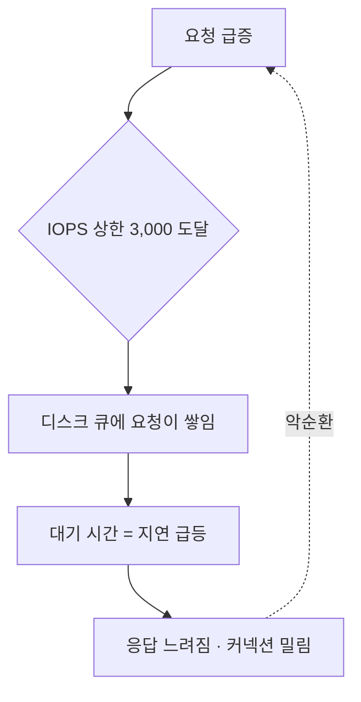
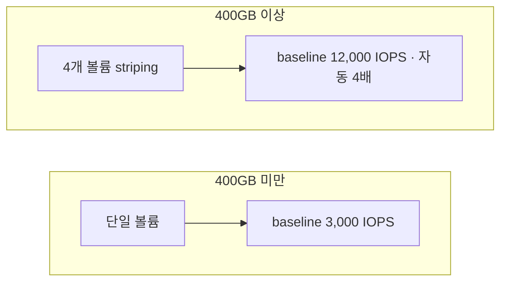

# **RDS IOPS 의 두 천장**
운영하던 DB 하나가 특정 시간대에 눈에 띄게 느려지는 일이 있었다. 평소엔 멀쩡한데 배치가 몰리거나 트래픽이 튀는 구간에 응답이 쭉 늘어지고, 심하면 커넥션이 밀렸다. CPU도 메모리도 여유가 있는데 느렸다. 결국 병목은 디스크 I/O, 정확히는 IOPS였다.

IOPS를 올렸더니 안정됐는데, 그 과정에서 몇 가지를 새로 알게 됐다. IOPS가 정확히 뭔지, 왜 클라우드에선 디스크 성능에 제한이 걸려있는지, 그리고 gp3의 400GB라는 숨은 임계까지. 이 글은 그 정리다.

## **증상 - CPU는 노는데 느리다**
CloudWatch 지표를 보니 그림이 명확했다.

- `ReadIOPS` + `WriteIOPS` 합이 3,000 근처에 딱 붙어서 천장을 친다
- `DiskQueueDepth`(디스크 대기 큐)가 평소 0~1이다가 그 구간에 확 치솟는다
- `ReadLatency` / `WriteLatency`(지연)가 같이 급등한다
- 반면 `CPUUtilization` 은 한가하다

이게 전형적인 IOPS 병목이다. 처리할 디스크 요청은 밀려드는데 디스크가 초당 받아줄 수 있는 양(IOPS)이 상한에 걸리니, 못 받은 요청이 큐에 쌓이고, 큐에서 기다리는 시간이 곧 지연으로 나타난다.

## **IOPS 가 뭐냐 - 큐와 지연의 관계**
IOPS(Input/Output Operations Per Second)는 말 그대로 초당 처리하는 디스크 읽기/쓰기 횟수다. 근데 이걸 큐·지연과 엮어서 보면 병목이 왜 생기는지가 확 와닿는다. 대략 이런 관계다.

~~~
IOPS = 큐 깊이(동시에 처리 중인 요청 수) ÷ 지연(요청 하나 처리 시간)
~~~

예를 들어 한 요청에 1ms 걸리는 디스크가 동시에 32개를 처리하면 초당 32,000번 처리한다. 여기서 핵심은, **디스크가 받아줄 수 있는 IOPS는 정해져 있는데 요청이 그걸 넘으면, 남는 요청은 큐에서 기다릴 수밖에 없고 그 대기가 지연으로 잡힌다**는 거다. 그래서 IOPS가 모자라면 큐가 쌓이고 지연이 튄다. 우리가 본 증상 그대로다.

한 가지 더, IOPS와 처리량(throughput, MB/s)은 다른 축이다. DB는 보통 작은 블록(PostgreSQL 8KB, InnoDB 16KB 식이다)을 무수히 읽고 쓰니 IOPS가 중요하고, 반대로 큰 파일을 죽 읽는 작업(백업, 스트리밍)은 처리량이 중요하다. 우리처럼 OLTP성 DB가 느리면 십중팔구 IOPS 쪽이다.

## **왜 클라우드엔 디스크 성능에 제한이 있나**
여기서 온프레미스만 다뤄본 사람은 좀 의아할 수 있다. 서버에 SSD 꽂으면 그 SSD의 물리 성능이 그냥 나오는데, 왜 클라우드는 IOPS에 상한이 있고 그걸 "올린다" 는 개념이 있을까.

이유는 클라우드 DB의 디스크가 물리적으로 붙어있는 게 아니라 네트워크 너머에 있기 때문이다. 온프레미스 SSD는 서버에 PCIe로 직결돼서, 디스크를 사는 순간 그 물리 성능이 고정으로 나온다. 반면 RDS가 쓰는 EBS는 인스턴스와 분리된 **네트워크 스토리지**다. 수많은 스토리지 서버를 묶은 풀에서 볼륨을 떼어주고, 모든 I/O가 네트워크를 타고 오간다.

그래서 클라우드에선 디스크 성능이 "물리적으로 정해진 것" 이 아니라 "얼마나 할당(프로비저닝)받았느냐" 가 된다. 성능을 돈 주고 사는 구조인 셈이다. 대신 네트워크 대역폭이라는 또다른 천장이 생겨서, IOPS를 아무리 올려도 네트워크가 병목이 되면 거기서 막힌다. 물리 직결이 아닌 대가다.

## **gp2 냐 gp3 냐 io2 냐**
RDS 스토리지 타입에 따라 IOPS를 정하는 방식이 다르다. 정리하면 이렇다.

| | gp2 | gp3 | io2 |
|---|---|---|---|
| IOPS 결정 방식 | 용량당 3 IOPS/GB | baseline 3,000 (400GB↑ 12,000) + 그 위 프로비저닝 | 순수 프로비저닝 |
| 용량과 IOPS | 종속 (용량 늘려야 IOPS↑) | 400GB 이상에서 독립 조절 (미만은 3,000/125 고정) | 독립 (단 IOPS:용량 비율 상한 있음) |
| 최대 IOPS | 64,000 | 64,000 | 256,000 |
| 특징 | 소용량은 burst로 버팀 | 크기·성능 분리, 400GB 임계 | 초고성능·고비용 |

옛날 기본값이던 gp2는 용량에 IOPS가 묶여있다. 100GB면 300 IOPS(3×100), 1TB는 3,000 IOPS 식이라, IOPS가 필요하면 안 쓰는 용량을 억지로 늘려야 했다(소용량은 burst로 잠깐 버티지만 지속되면 바닥난다). 표에서 보듯 gp2도 최대치 자체는 gp3와 같은 64,000이다. 차이는 거기 도달하는 방법이다 — gp2는 3 IOPS/GB 규칙에 묶여 있어 용량을 20TB 넘게 키워야 그 숫자가 나오고(64,000 ÷ 3 ≈ 21,300GB), gp3는 400GB만 넘기면 그 위로는 용량과 무관하게 IOPS를 따로 살 수 있다. gp3는 이 종속을 느슨하게 풀어서 baseline 3,000을 크기와 무관하게 주는데, 그 위로 IOPS를 더 올리는 데는 400GB 임계라는 조건이 붙는다(바로 아래에서 다룬다). io2는 훨씬 높은 성능이 필요할 때(수만~수십만 IOPS) 쓰는데 비싸다. 우리는 gp3였다.

## **gp3 의 400GB 숨은 임계**
그런데 gp3에서 IOPS를 올리려다 재밌는 걸 발견했다. gp3 baseline은 크기와 무관하게 3,000 IOPS인데, **용량이 400GB에 닿는 순간 baseline이 12,000 IOPS / 500MB/s로 자동으로 4배가 된다.** IOPS를 따로 사지 않아도 그렇다.

이유는 볼륨 striping이다. 400GB부터 RDS가 내부적으로 볼륨을 4개로 쪼개 나란히 붙이는데(striping), 4개가 병렬로 I/O를 받으니 baseline이 4배가 되는 것이다. (PostgreSQL·MySQL·MariaDB·Db2 기준 400GB, Oracle은 200GB다. SQL Server만 striping을 안 해서 임계 자체가 없고, 대신 크기와 상관없이 IOPS를 프로비저닝할 수 있다.) 참고로 이 400GB 볼륨 분할은 gp3 전용 규칙이 아니라 RDS SSD 스토리지 공통이다. gp2도 같은 지점에서 burst IOPS가 3,000에서 12,000으로 뛴다.

우리 상황이 딱 여기 걸렸다. 원래 100GB짜리였는데, IOPS를 올리려고 보니 아예 방법이 없었다. RDS gp3는 400GB 미만이면 IOPS를 못 올리게 막아둔다. 3,000/125가 유일한 스펙이라, 콘솔에서 IOPS 입력칸 자체가 안 열린다. 즉 gp3 안에 머무는 한 IOPS를 올리는 길은 용량을 400GB로 키우는 것뿐이다. (gp3를 벗어나면 io2로 바꾸는 수가 있다. io2는 100GB에서도 IOPS를 따로 살 수 있다. 대신 비싸서 우리 규모엔 과했다.) 그래서 400GB로 올렸더니, IOPS를 따로 프로비저닝하지 않고도 striping 덕에 baseline이 12,000으로 뛰었다. IOPS만 올리고 싶었는데 용량을 올려야 했던 게, 알고 보니 강제이자 이득이었다. 400GB에 닿는 순간 성능 4배가 딸려왔으니까.

이게 헷갈리기 쉬운 지점이다. 400GB 미만에선 IOPS를 아예 못 올리니, 소용량 DB가 IOPS 부족으로 느리면 답은 하나다. 용량을 400GB로 키우는 것. 그럼 striping으로 baseline이 3,000에서 12,000으로 뛴다. 그래서 380GB에서 "IOPS 좀 올리고 싶은데" 하고 있으면 손댈 데가 없어 답답한데, 400GB만 채우면 4배가 열린다. "용량은 남는데 왜 굳이 400GB까지 올려" 싶어도, gp3에선 용량이 곧 IOPS로 들어가는 문인 셈이다.

## **올리는 것 자체가 공짜는 아니다**
여기까지 읽고 바로 콘솔을 열기 전에, 내가 하고 나서야 제대로 알아본 것 두 가지를 먼저 적어둔다.

첫째, **이 변경은 가벼운 조작이 아니다.** 볼륨이 1개에서 4개로 바뀌는 거라 RDS가 Elastic Volumes로 슥 늘려주는 게 아니라, 새 볼륨들을 만들어 데이터를 통째로 옮긴다. AWS 문서가 이걸 따로 경고한다 — 이 작업은 옛 볼륨과 새 볼륨 양쪽의 IOPS와 처리량을 상당히 잡아먹고, **I/O 지연을 크게 높이며, 몇 시간이 걸릴 수 있고**, 그동안 인스턴스는 `Modifying` 상태로 있는다. 그래서 피크 시간대를 피해서 잡으라고 권한다. 하필 이 글을 찾아 읽는 사람은 "이미 I/O 때문에 느린 DB" 를 들고 있을 텐데, 그 상태에서 낮에 눌러버리면 몇 시간 동안 더 느려진다. 고치려던 증상이 그 사이 더 심해지는 것이다. 우리는 운 좋게 한가한 시간에 걸었지만, 알고 한 게 아니었다.

둘째, **용량 요금은 4배가 되고 되돌릴 수 없다.** 무료인 건 baseline 성능 상향분이지 용량이 아니다. 100GB에서 400GB면 스토리지 요금이 그대로 4배다. 게다가 RDS는 할당한 스토리지를 줄이지 못한다. 늘리는 건 되는데 줄이는 건 안 된다. 즉 "IOPS 좀 올려보자" 는 영구적인 요금 인상이다. 그래도 io2로 갈아타거나 인스턴스를 키우는 것보다는 확실히 쌌지만, 이건 비교를 해보고 고를 일이지 공짜라서 고를 일이 아니었다.

그 대가를 치르고 나서, 문제의 시간대를 다시 지켜봤다. `DiskQueueDepth` 가 더는 안 치솟고 0~1 언저리를 유지했고, `ReadLatency`/`WriteLatency` 도 평평해졌다. 3,000에 눌려 평평하던 IOPS 그래프가 실수요만큼 올라갔다 내려오는 모양으로 바뀌었다. CPU가 놀면서 느리던 그 현상이 사라졌다.

## **끝난 줄 알았는데 온 경고**
이걸로 끝인 줄 알았는데, 얼마 뒤 AWS가 권장사항 알림을 하나 보냈다. 항목 이름은 `RDS instances are under-provisioned for system IOPS capacity`, 요지는 "이 인스턴스는 프로비저닝된 IOPS를 지원할 수 없으니, 워크로드를 줄여 IOPS를 낮추거나 인스턴스를 스케일업하라" 였다. 스토리지는 분명 12,000으로 올려놨는데 인스턴스가 못 따라온다는 얘기였다.

알고 보니 IOPS 천장이 하나가 아니었다. 지금까지 얘기한 12,000은 스토리지(gp3) 쪽 천장이다. 그런데 그 스토리지가 붙은 인스턴스 자체에도, EBS로 밀어낼 수 있는 IOPS 한도가 따로 있다. 실제로 나오는 IOPS는 이 둘 중 낮은 쪽에서 막힌다. 스토리지를 12,000으로 올려도 인스턴스가 그만큼 못 밀어내면 소용이 없는 거다.

## **t4g 는 EBS 도 burst 다**
우리 인스턴스는 db.t4g.xlarge였다. t 계열은 버스터블(burstable) 인스턴스로 유명한데, 보통 CPU 얘기로만 안다. 평소엔 baseline만 쓰다가 부하가 잠깐 튈 때 burst로 올라가는 그거다. 근데 잘 안 알려진 게, 이 인스턴스는 EBS 성능도 baseline과 burst로 나뉜다는 점이다. (CPU 크레딧과는 별개로 관리되는 값이다.) 덧붙이면 이건 t 계열 전용도 아니다. m·r 계열도 작은 사이즈는 EBS가 baseline/burst로 갈린다.

db.t4g.xlarge의 EBS 스펙은 이렇다.

- baseline IOPS: 4,000 (지속적으로 보장되는 값)
- 최대 IOPS: 15,700 (짧게 burst로만 가능)

baseline만 보면 인스턴스가 스토리지 성능을 한참 못 받쳐준다. 스토리지는 12,000을 주는데 인스턴스 baseline이 4,000이고, 처리량도 스토리지 500MB/s에 인스턴스 baseline이 87MB/s다. "아 그래서 병목이구나, 스케일업해야겠네" 싶었다. 근데 burst 크레딧을 실측해보고 생각이 바뀌었다.

burst 잔량을 보여주는 지표가 두 개 있다. `EBSIOBalance%`(IOPS 크레딧)와 `EBSByteBalance%`(처리량 크레딧)다. 크레딧이 남아있으면 baseline을 넘겨도 burst로 낼 수 있고, 0에 가까우면 baseline으로 주저앉는다. 지난 7일 최저값을 떠봤다.

절반은 맞고 절반은 틀렸다. IOPS 크레딧은 최저 97%, 처리량 크레딧은 최저 6%였다. IOPS는 피크가 10,947이었어도 그 순간이 워낙 짧아 크레딧을 거의 안 썼다. 인스턴스가 스토리지를 못 받쳐준다는 진단 자체는 맞았는데, 축이 IOPS가 아니라 처리량이었던 거다. 정작 바닥을 친 건 처리량 크레딧이고, 그것도 대량 조회가 돌던 특정 하루만 6%까지 갔지 나머지 6일은 멀쩡했다.

여기서 교훈이 나왔다. 경고가 지목한 축은 IOPS였는데, 실제로 바닥을 친 건 처리량이었다. 방향은 맞고 항목이 틀린 셈이다. AWS 권장사항에는 IOPS용(`under-provisioned for system IOPS capacity`)과 처리량용(`under-provisioned for throughput capacity`)이 **따로** 있는데, 우리가 받은 건 IOPS 쪽이었다. 그 경고가 권한 건 "IOPS를 낮춰라" 아니면 "인스턴스를 키워라" 둘이다. 앞엣것을 따랐다면 400GB로 올려 얻은 걸 도로 반납하는 꼴이고, 뒤엣것을 이름만 보고 급하게 따랐다면 IOPS 스펙만 보고 인스턴스를 골라 정작 처리량은 그대로였을 수 있다. 어느 쪽이든 크레딧 지표를 직접 안 떠봤으면 엉뚱한 데 돈을 썼을 거다.

여기서 이 97%를 잘못 읽기 쉬우니 한 번 짚고 간다. "용량의 97%가 논다" 는 뜻이 아니다. 피크 10,947은 스토리지 12,000의 91%를 쓴다. 크레딧이 안 닳았다는 건 baseline 4,000을 넘긴 시간이 짧았다는 뜻이지, 여유가 많다는 뜻이 아니다. 분모가 다른 숫자다.

그래서 결론은 "지금은 아무것도 안 한다" 였다. IOPS 쪽은 지속 초과가 없으니 당장 손댈 데가 없고, 400GB gp3에선 12,000이 딸려오는 하한이라 줄이고 싶어도 못 줄인다. 남은 건 처리량인데, 7일 중 하루 6%까지 떨어진 걸 봤을 뿐이라 이게 매주 오는 패턴인지 그날 한 번인지 아직 모른다. 관측 1회로 주기를 정할 수는 없으니 `EBSByteBalance%` 에 알람을 걸고 몇 주 더 보기로 했다.

옮긴다면 사이즈를 잘 봐야 한다. "r6g나 m6g로 가면 되지" 가 함정인데, `r6g.large`·`m6g.large` 는 처리량 baseline이 78.75MB/s로 지금 쓰는 `t4g.xlarge`(86.88MB/s)보다 **오히려 낮다**. 비용은 오르는데 크레딧은 더 빨리 마른다. 개선되려면 최소 `xlarge`(148.5MB/s)여야 하고, 아예 burst에 안 기대려면 `4xlarge` 이상으로 가야 한다. EBS baseline·burst가 갈리는 건 t 계열만의 얘기가 아니라서, m·r 계열도 작은 사이즈는 똑같이 크레딧으로 버틴다. 인스턴스 클래스를 고를 땐 vCPU·메모리 말고 EBS 표를 따로 봐야 한다는 걸 이번에 배웠다.

## **정리**
- CPU·메모리는 여유인데 느리면 디스크 IOPS 병목을 의심한다. `DiskQueueDepth` 급등 + `ReadLatency`/`WriteLatency` 급등 + IOPS가 천장에 붙는 조합이 신호다.
- IOPS는 초당 I/O 횟수고, `IOPS = 큐깊이 / 지연` 이다. IOPS가 모자라면 큐가 쌓이고 그 대기가 지연으로 나타난다. (작은 블록 DB는 IOPS, 큰 순차 작업은 throughput)
- 클라우드 DB 디스크(EBS)는 네트워크 스토리지라, 물리 SSD와 달리 성능을 프로비저닝(구매)한다. 대신 네트워크가 또다른 천장이다.
- gp2는 용량당 IOPS(종속), gp3는 baseline 3,000 + 400GB 이상에서 독립 조절, io2는 초고성능. gp3의 baseline은 **400GB에 닿으면 striping으로 12,000까지 자동 4배**가 된다. 단 이건 스토리지 쪽 숫자고, 실제로 지속되는 IOPS는 인스턴스 EBS baseline과의 낮은 쪽이다.
- IOPS가 모자라면 무작정 프로비저닝하기 전에 용량이 400GB 근처인지부터 본다. 임계 하나로 4배가 갈린다. 대신 그 확장은 볼륨을 4개로 재구성하는 몇 시간짜리 I/O 집약 작업이고, 용량 요금은 4배가 되며 되돌릴 수 없다. 피크를 피해서 건다.
- IOPS 천장은 스토리지와 인스턴스 두 곳에 있고, 인스턴스 burst는 크레딧으로 버틴다. baseline을 넘어도 `EBSIOBalance%`(IOPS)·`EBSByteBalance%`(처리량) 크레딧이 남으면 괜찮다.
- AWS 권장사항은 경고 이름(IOPS)과 실제 병목(처리량)이 다를 수 있다. 곧이곧대로 스케일업하지 말고, 크레딧 지표를 직접 보고 판단한다. 이름만 보고 움직이면 엉뚱한 데 돈 쓴다.

온프레미스에서 디스크는 사면 끝인 물리 부품이었는데, 클라우드에선 용량·IOPS·처리량이 따로 도는 손잡이 세트가 됐다. 편해진 만큼 400GB 임계 같은 규칙을 알아야 헛돈을 안 쓴다. 결국 성능 튜닝은 "어느 손잡이가 지금 병목이냐" 를 정확히 짚는 일이더라.
